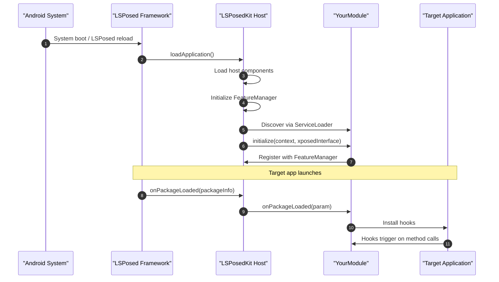
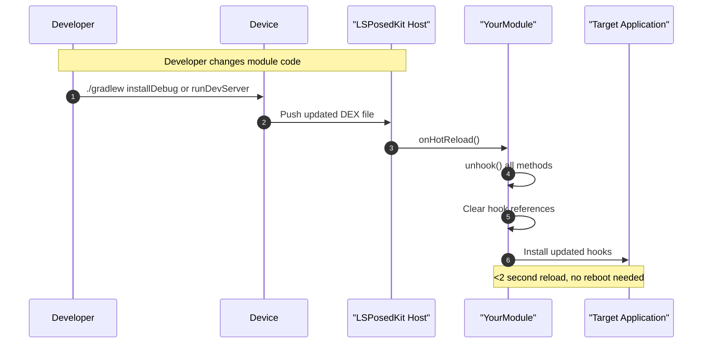

# LSPosedKit Blueprint (Android 15)

> A comprehensive architectural overview of LSPosedKit's structure, lifecycle, and design philosophy.

## Repository Layout

```text
LSPosedKit/
├── framework/           # Core runtime components
│   ├── core/            # Runtime initialization, module loading, service registry
│   ├── processor/       # Annotation processing for module metadata
│   ├── hot/             # Hot-reload engine and DEX patching
│   └── settings/        # Settings provider and preference APIs
├── libxposed-api/       # Upstream LSPosed API as bundled source
│   ├── api/             # Core API interfaces and classes
│   └── services/        # Optional LSPosed services wrappers
├── modules/             # One sub-project per module
│   ├── DebugApp/        # Example: Enable debugging flags
│   ├── NetworkGuard/    # Example: Network traffic monitor/blocker
│   └── IntentMaster/    # Example: Intent manipulation tool
├── Docs/                # Comprehensive documentation
└── scripts/             # Utility scripts for development workflow
```

## Life-cycle Overview

### Module Initialization Flow



### Hot-Reload Cycle



## Version Compatibility Matrix

| Component              | Supported Versions                            | Notes                                 |
|------------------------|-----------------------------------------------|-----------------------------------------|
| **Android OS**         | 15 (API 35)                                   | Primary target; optimized for ART 15.0 |
|                        | 14 (API 34)                                   | Full support with hot-reload           |
|                        | 13 (API 33)                                   | Full support with hot-reload           |
|                        | 12 (API 31-32)                                | Compatible, limited hot-reload         |
| **Java/Kotlin**        | Java 17 (default)                             | Required minimum                       |
|                        | Java 21 (optional via `-Pjava21`)             | Experimental support                   |
|                        | Kotlin 1.9+                                   | Recommended for module development     |
| **Build Tools**        | Gradle 8.4+                                   | Required for Android 15 support        |
|                        | AGP 8.3+                                      | Required for proper DEX generation     |
| **LSPosed Manager**    | v1.9.0+                                       | Required for module management         |

## Architecture Principles

LSPosedKit follows these core design principles:

1. **Zero Boilerplate**: Annotations and code generation replace manual configuration files
2. **Fast Iteration**: Hot-reload capability for rapid development cycles
3. **Type Safety**: Fully typed APIs with compile-time checks
4. **Dependency Management**: Explicit versioning and module dependencies
5. **Testability**: First-class support for unit and integration testing

## Core Components

### Runtime Host

The `LspkRuntime` class serves as the primary entry point, handling:

- Module discovery and initialization
- Service registration and lifecycle management
- Hook coordination across multiple modules
- DEX patching and hot-reload orchestration

### Service Bus

The `FeatureManager` provides a centralized pub/sub system for:

- Cross-module communication
- Feature discovery and dependency resolution
- Thread-safe service registry with lifecycle awareness

### Settings Provider

The `SettingsProvider` offers:

- Type-safe preference access
- Automatic UI generation from schema
- Live updates to module configurations

## Development Workflow

```mermaid
graph TD
    A[Clone LSPosedKit Repository] --> B(Import Project in IDE)
    B --> C{New or Existing Module?}
    C -- New --> D[Run newModule script]
    C -- Existing --> E[Edit module code]
    D --> E
    E --> F[Build & Deploy]
    F --> G[Test on Device]
    G -- Issues? --> H[Live Debug via Hot-Reload]
    H --> E
    G -- Working --> I[Prepare for Release]
    I --> J[Generate .lspkmod Bundle]
</rewritten_file> 