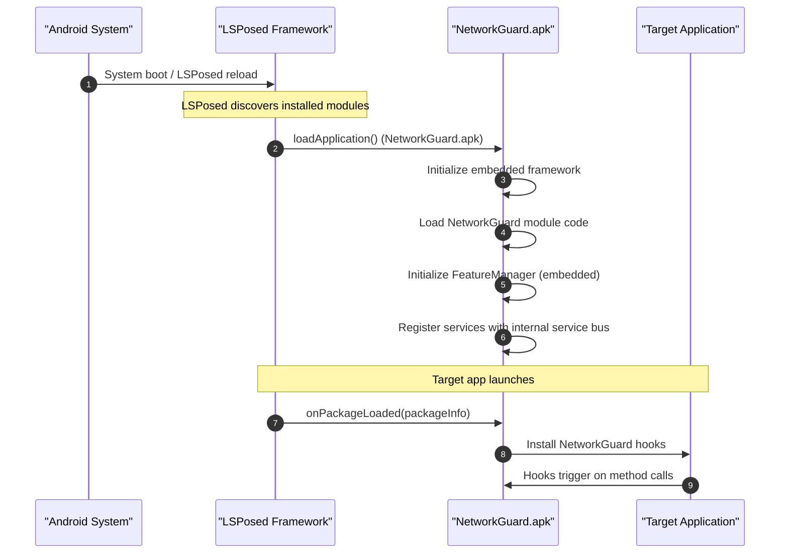
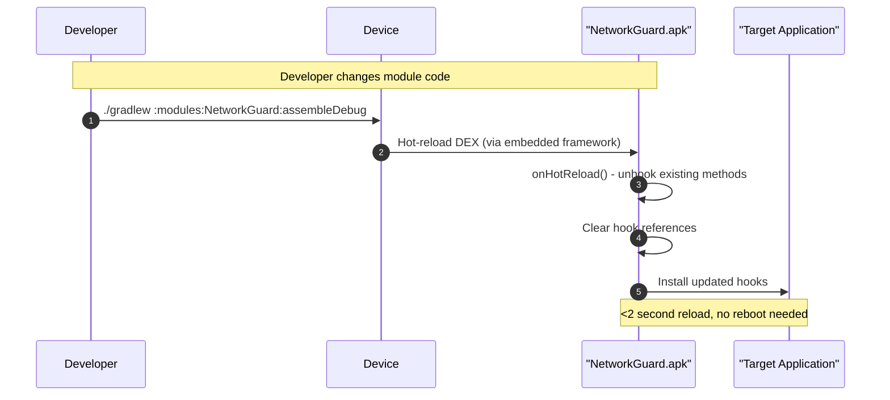
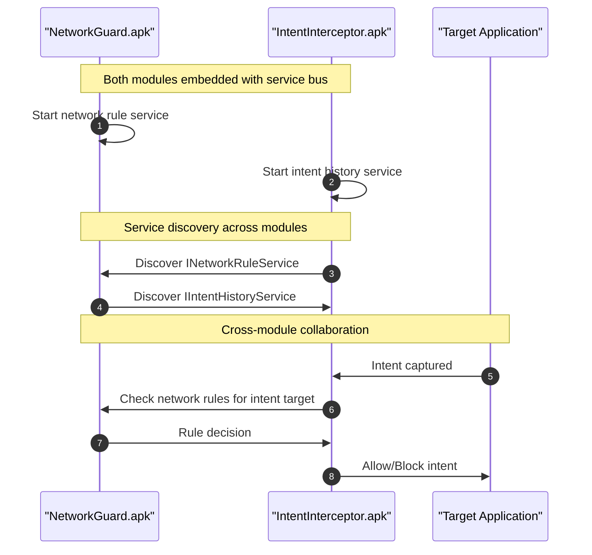
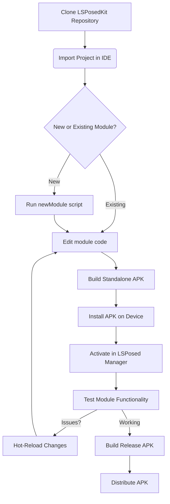

# LSPosedKit Blueprint (Android 15)

> A comprehensive architectural overview of LSPosedKit's structure, lifecycle, and design philosophy for **standalone module APKs**.

## Repository Layout

```text
LSPosedKit/
├── framework/           # Core runtime components (embedded in each module)
│   ├── core/            # Runtime initialization, module loading, service registry
│   ├── processor/       # Annotation processing for module metadata
│   ├── hot/             # Hot-reload engine and DEX patching
│   ├── service/         # Service bus for cross-module communication
│   └── settings/        # Settings provider and preference APIs
├── libxposed-api/       # Upstream LSPosed API as bundled source
│   ├── api/             # Core API interfaces and classes
│   └── services/        # Optional LSPosed services wrappers
├── modules/             # Standalone module APKs (one per feature)
│   ├── DebugApp/        # → DebugApp.apk (standalone)
│   ├── NetworkGuard/    # → NetworkGuard.apk (standalone)
│   ├── IntentInterceptor/ # → IntentInterceptor.apk (standalone)
│   └── UIEnhancer/      # → UIEnhancer.apk (standalone)
├── Docs/                # Comprehensive documentation
└── scripts/             # Utility scripts for development workflow
```

## Standalone APK Architecture

**Key Principle**: Each LSPosed module is a complete, standalone APK containing the entire LSPosedKit framework embedded within it.

```
┌─────────────────────────────────────┐
│        NetworkGuard.apk             │
├─────────────────────────────────────┤
│ ✓ NetworkGuard module code          │
│ ✓ LSPosedKit framework (embedded)   │
│   ├─ Core runtime                   │
│   ├─ Settings system                │
│   ├─ Service bus                    │
│   ├─ Hot-reload support             │
│   └─ Annotation processors          │
│ ✓ Generated metadata               │
│   ├─ module.prop                    │
│   ├─ xposed_init                    │
│   └─ module-info.json              │
└─────────────────────────────────────┘
```

**No external dependencies** — install any module independently!

## Life-cycle Overview

### Module Initialization Flow



### Hot-Reload Cycle (Standalone Module)



### Cross-Module Communication (When Multiple Modules Installed)



## Version Compatibility Matrix

| Component              | Supported Versions                            | Notes                                 |
|------------------------|-----------------------------------------------|-----------------------------------------|
| **Android OS**         | 15 (API 35)                                   | Primary target; optimized for ART 15.0 |
|                        | 14 (API 34)                                   | Full support with hot-reload           |
|                        | 13 (API 33)                                   | Full support with hot-reload           |
|                        | 12 (API 31-32)                                | Compatible, limited hot-reload         |
| **Java/Kotlin**        | Java 17 (default)                             | Required minimum                       |
|                        | Java 21 (optional via `-Pjava21`)             | Experimental support                   |
|                        | Kotlin 1.9+                                   | Recommended for module development     |
| **Build Tools**        | Gradle 8.4+                                   | Required for Android 15 support        |
|                        | AGP 8.3+                                      | Required for proper DEX generation     |
| **LSPosed Manager**    | v1.9.0+                                       | Required for module management         |

## Architecture Principles

LSPosedKit follows these core design principles:

1. **Standalone APKs**: Each module is completely self-contained with embedded framework
2. **Zero Boilerplate**: Annotations and code generation replace manual configuration files
3. **Fast Iteration**: Hot-reload capability for rapid development cycles
4. **Type Safety**: Fully typed APIs with compile-time checks
5. **Cross-Module Services**: Service bus enables communication between installed modules
6. **Testability**: First-class support for unit and integration testing

## Core Components (Embedded in Each Module)

### Framework Runtime

Each module APK contains an embedded `LSPosedKitRuntime` that handles:

- Module initialization and lifecycle management
- Service registration with internal FeatureManager
- Hook coordination within the module
- DEX patching and hot-reload orchestration
- Cross-module service discovery

### Service Bus (Per Module)

Each module includes an embedded `FeatureManager` that provides:

- Internal service registry for the module's services
- Cross-module communication when multiple LSPosedKit modules are installed
- Feature discovery and dependency resolution
- Thread-safe service registry with lifecycle awareness

### Settings Provider (Per Module)

Each module includes an embedded `SettingsProvider` that offers:

- Type-safe preference access specific to that module
- Automatic UI generation from the module's settings.json schema
- Live updates to module configurations
- Integration with LSPosed Manager settings

## Module Structure

### Generated Files (Per Module)

Each module's annotation processor generates:

```
modules/NetworkGuard/src/main/assets/
├── module.prop          ← LSPosed metadata (id, version, scope)
├── xposed_init          ← Entry point class name
├── module-info.json     ← Extended metadata (dependencies, services)
└── settings.json        ← Settings schema (authored by developer)
```

### APK Structure

```
NetworkGuard-release.apk
├── classes.dex          ← NetworkGuard code + embedded LSPosedKit framework
├── assets/
│   ├── module.prop
│   ├── xposed_init  
│   ├── module-info.json
│   └── settings.json
├── res/                 ← Android resources (if any)
└── AndroidManifest.xml  ← Application manifest
```

## Development Workflow



## Distribution Model

### Single APK Distribution

- **Traditional**: Share `.apk` files directly
- **GitHub Releases**: Automated APK uploads via CI/CD
- **F-Droid**: Open-source module distribution
- **Direct Install**: `adb install NetworkGuard.apk`

### No Bundle Format Needed

Unlike traditional LSPosed development, LSPosedKit modules are distributed as standard Android APKs:

✅ **Standard APK** → Install with any APK installer  
❌ **Custom .lspkmod bundles** → No longer needed  
✅ **Play Store compatible** → Standard Android app structure  
❌ **Xposed repo dependency** → Completely independent  

## Multi-Module Scenarios

When multiple LSPosedKit modules are installed:

1. **Independent Operation**: Each module works standalone
2. **Service Discovery**: Modules can discover each other's services
3. **Cross-Module APIs**: Shared interfaces via service bus
4. **Coordinated Features**: Advanced scenarios with module collaboration

Example: `NetworkGuard` + `IntentInterceptor` working together:
- IntentInterceptor captures an Intent to launch a network-capable app
- Queries NetworkGuard's service to check if the target app has network restrictions
- Blocks or allows the Intent based on NetworkGuard's rules

## Key Benefits of Standalone Architecture

1. **No Host Dependency**: Install any module independently
2. **Simple Distribution**: Standard APK sharing/hosting
3. **LSPosed Manager Integration**: Each module appears as a separate entry
4. **Hot-Reload Per Module**: Fast iteration without affecting other modules
5. **Cross-Module Services**: Optional collaboration when multiple modules installed
6. **Standard Android Tooling**: Use existing APK analysis/debugging tools 