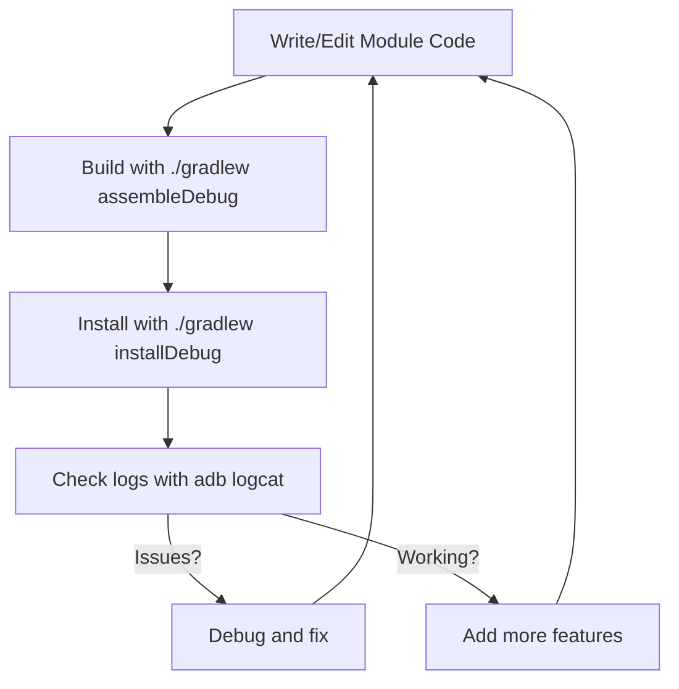

# Getting Started with LSPosedKit

> Complete guide to setting up your development environment, building your first module, and understanding the LSPosedKit workflow.

## System Requirements

### Development Environment

| Component               | Requirement                             | Notes                                       |
|-------------------------|----------------------------------------|---------------------------------------------|
| **Operating System**    | Windows, macOS, or Linux               | Any OS that supports Android development    |
| **IDE**                 | Android Studio Hedgehog Canary (or newer) | Recommended for best Android 15 support     |
|                         | Cursor.ai                              | Alternative with AI assistance              |
| **JDK**                 | JDK 17 (Temurin/Eclipse Adoptium)      | Required minimum                            |
|                         | JDK 21 (optional)                      | Enable with `-Pjava21` flag                 |
| **Android SDK**         | API 35 (Android 15) SDK                | Required for full feature support           |
| **Gradle**              | 8.4 or newer                           | Required for Android 15 build support       |
| **Build Tools**         | 35.0.0 or newer                        | Needed for API 35 compatibility             |

### Test Device Requirements

| Component               | Requirement                             | Notes                                       |
|-------------------------|----------------------------------------|---------------------------------------------|
| **Android Version**     | Android 15 (API 35)                    | Recommended for full feature set            |
|                         | Android 12-14 (API 31-34)              | Compatible with limitations                 |
| **Device Status**       | Rooted                                 | Required for LSPosed framework              |
| **LSPosed Framework**   | v1.9.0 or newer                        | Required for module execution               |
| **LSPosed Manager**     | Latest version                         | Required for module management              |

## Environment Setup

### Step 1: IDE and SDK Configuration

1. **Install Android Studio Hedgehog** (or newer):
   - Download from [Android Developer site](https://developer.android.com/studio/preview)
   - During installation, ensure the Android SDK is installed

2. **Configure SDK Components**:
   - Open Android Studio → Settings/Preferences → Appearance & Behavior → System Settings → Android SDK
   - Install or update:
     - Android 15 (API 35) SDK Platform
     - Android SDK Build-Tools 35.0.0
     - Android SDK Command-line Tools
     - Android SDK Platform-Tools

3. **Set up JDK 17**:
   - Download and install [Eclipse Temurin JDK 17](https://adoptium.net/temurin/releases/?version=17)
   - Configure in Android Studio: Settings/Preferences → Build, Execution, Deployment → Build Tools → Gradle
   - Set "Gradle JDK" to your JDK 17 installation

### Step 2: Prepare Test Device

1. **Root your device** (if not already rooted)
   - Method varies by device manufacturer
   - Recommended: Use [Magisk](https://github.com/topjohnwu/Magisk)

2. **Install LSPosed Framework**:
   - Install latest [LSPosed Magisk Module](https://github.com/LSPosed/LSPosed/releases)
   - Reboot your device
   - Verify LSPosed Manager is installed

3. **Enable USB Debugging**:
   - Settings → System → Developer options → USB debugging
   - Connect to computer and authorize debugging

## Cloning and Initial Setup

```bash
# Clone the repository
git clone https://github.com/your-org/LSPosedKit.git

# Navigate to project directory
cd LSPosedKit

# Initialize and update submodules (for libxposed-api)
git submodule update --init --recursive

# Optional: Verify your environment
./gradlew environmentCheck
```

## Build and Install

```bash
# Build everything in debug mode
./gradlew assembleDebug

# Install to connected device 
./gradlew installDebug

# Optional: Refresh package database
adb shell cmd package reconcile

# View logs during testing
adb logcat -s LSPK:* -v time
```

## First-Time Module Activation

1. Open **LSPosed Manager** on your device
2. Navigate to **Modules** tab
3. Enable **LSPK Host** (required)
4. Enable at least one module (e.g., "NetworkGuard")
5. Tap the check (✓) icon to apply changes
6. Reboot your device when prompted

## Verifying Installation

After reboot, check for proper initialization:

```bash
# Filter for module-specific logs
adb logcat -s LSPK-NetworkGuard:V | grep "\[INIT\]"
```

Expected output:
```
05-22 12:34:56.789 LSPK-NetworkGuard I [INIT] NetworkGuard loaded for com.android.systemui
```

## Creating Your First Module

### Option 1: Use the Scaffold Script (Recommended)

```bash
# Create a new module with standardized template
./gradlew :scripts:newModule -Pname="Debug App" -Pid=debug-app
```

This creates:
- Module directory structure under `modules/debug-app/`
- Basic Gradle configuration
- Skeleton module implementation
- Starter `settings.json` and `module-info.json`
- Test directory with unit test template

### Option 2: Manual Setup

1. Create module directory:
   ```bash
   mkdir -p modules/debug-app/src/main/{java,assets,res}
   ```

2. Create Gradle build file (`modules/debug-app/build.gradle`):
   ```groovy
   plugins {
       id 'com.android.library'
       id 'org.jetbrains.kotlin.android'
       id 'org.jetbrains.kotlin.kapt'
   }
   
   android {
       namespace 'com.example.debugapp'
       compileSdk 35
       
       defaultConfig {
           minSdk 31
           targetSdk 35
       }
   }
   
   dependencies {
       implementation project(':framework')
       kapt project(':framework:processor')
   }
   ```

3. Create minimal module implementation:
   ```kotlin
   // src/main/java/com/example/debugapp/DebugApp.kt
   package com.example.debugapp
   
   import com.wobbz.framework.core.IModulePlugin
   import com.wobbz.framework.hot.IHotReloadable
   import com.wobbz.framework.processor.HotReloadable
   import com.wobbz.framework.processor.XposedPlugin
   
   @XposedPlugin(
     id = "debug-app",
     name = "Debug App",
     version = "1.0.0",
     scope = ["*"],
     description = "My first LSPosedKit module",
     author = "Your Name"
   )
   @HotReloadable
   class DebugApp : IModulePlugin, IHotReloadable {
     override fun onPackageLoaded(param: PackageLoadedParam) {
       // Your hook logic goes here
     }
     
     override fun onHotReload() {
       // Your hot-reload logic goes here
     }
   }
   ```

4. Register in `settings.gradle`:
   ```groovy
   include ':modules:debug-app'
   ```

## Development Workflow



For rapid development, use Hot-Reload:

1. Start development server:
   ```bash
   ./gradlew runDevServer
   ```

2. Make code changes and build:
   ```bash
   ./gradlew :modules:debug-app:assembleDebug
   ```

3. Hot-reload will automatically push changes to device (~2 seconds)

## Common First-Time Issues

| Issue | Solution |
|-------|----------|
| **Module not showing in LSPosed Manager** | Ensure LSPK Host is enabled; check for build errors; verify module metadata |
| **"App not installed" error** | Uninstall existing app first; check for signature conflicts |
| **No logs appearing** | Check tag filters; ensure module is enabled in LSPosed Manager |
| **Hot-reload not working** | Verify DEX patch server is running; check ADB connection; ensure module implements `IHotReloadable` |
| **Hooks not applying** | Verify package name in scope array; check for typos in class/method names; use `xp.log()` to debug |

## Next Steps

- Review [02-annotations.md](02-annotations.md) to understand module metadata
- Explore [03-settings-schema.md](03-settings-schema.md) for adding user preferences
- See [10-examples.md](10-examples.md) for real-world module examples 