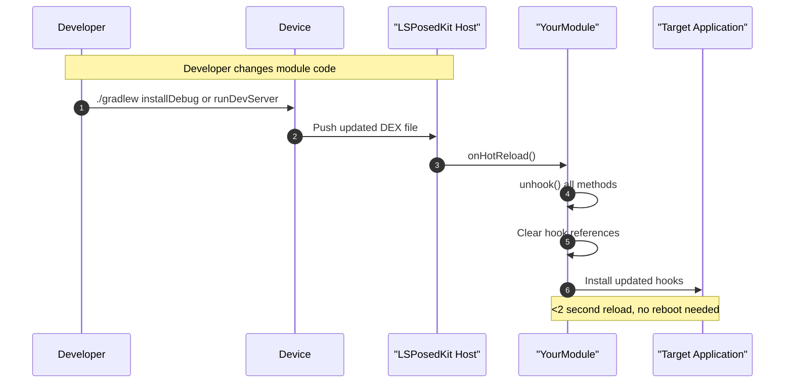
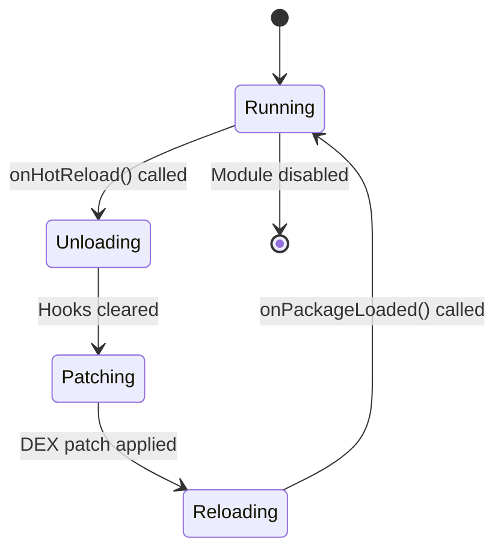

# Hot-Reload Deep Dive

> Comprehensive guide to LSPosedKit's hot-reload system, which enables real-time code updates without device reboots or app restarts. Learn how it works, best practices, and advanced techniques.

## Overview

LSPosedKit's hot-reload system is a groundbreaking feature that dramatically improves the module development experience. Instead of the traditional slow cycle of:

1. Code changes
2. Build
3. Install
4. Reboot device
5. Test
6. Repeat

With hot-reload, your workflow becomes:

1. Code changes
2. Build
3. Automatic hot-reload (~2 seconds)
4. Test
5. Repeat

This guide explains how this system works, how to use it effectively, and how to troubleshoot common issues.

## How Hot-Reload Works

### Technical Foundation

LSPosedKit's hot-reload system leverages Android's ART (Android Runtime) capabilities, aiming to use the most stable methods available, such as the DexPatch API on newer Android versions (Android 15+), for incremental DEX code updates without full application restarts.

**Note on DEX Patching:** The underlying mechanisms for DEX patching, especially on older Android versions or if relying on reflection into ART internals (as might be conceptualized in a `DexPatcher.kt`), can be inherently fragile and device-dependent. LSPosedKit aims to use official APIs like `DexFile.defineClass` where feasible or implement robust fallbacks. Thorough testing across different Android versions and devices is critical. Future improvements will focus on increasing the robustness of this process, potentially including configuration options for different patching strategies and detailed logging for diagnostics.



### Core Components

1. **DexPatchServer**: A background service that listens for incoming DEX updates over ADB
2. **PatchInstaller**: Handles the verification and installation of DEX patches
3. **ReloadBroadcaster**: Notifies modules when their code has been updated
4. **IHotReloadable**: Interface implemented by modules to support hot-reload

### Update Flow

1. The developer makes code changes and builds the module
2. The updated DEX file is pushed to `/data/local/tmp/lspk-hot/[module-id].dex`
3. A broadcast intent triggers the reload process
4. The module's `onHotReload()` method is called to clean up existing hooks
5. The updated code is applied to the runtime
6. The target app continues running with the updated hooks

## Setting Up Hot-Reload

### Basic Setup

1. Implement the `IHotReloadable` interface in your module class:

```kotlin
@XposedPlugin(
    id = "debug-app",
    name = "Debug App",
    version = "1.0.0",
    scope = ["com.android.chrome"],
    description = "My awesome module"
)
@HotReloadable
class DebugApp : IModulePlugin, IHotReloadable {
    private val hooks = mutableListOf<MethodUnhooker<*>>()
    
    override fun onPackageLoaded(param: PackageLoadedParam) {
        // Store hook references
        hooks += param.xposed.hook(...)
    }
    
    override fun onHotReload() {
        // Clean up existing hooks
        hooks.forEach { it.unhook() }
        hooks.clear()
    }
}
```

2. Start the hot-reload server:

```bash
./gradlew runDevServer
```

3. Make changes, build, and watch the magic happen:

```bash
./gradlew :modules:debug-app:assembleDebug
```

## Advanced Hot-Reload Techniques

### Manual DEX Patching

For situations where the automatic system isn't suitable, you can manually patch:

```bash
# Build your module
./gradlew :modules:debug-app:assembleDebug

# Push the DEX file to the device
adb push modules/debug-app/build/intermediates/dex/debug/out/classes.dex \
    /data/local/tmp/lspk-hot/debug-app.dex

# Trigger the reload broadcast
adb shell am broadcast -a com.wobbz.lspk.ACTION_LSPK_RELOAD \
    --ez force true --es module debug-app
```

### Selective Class Reloading

For complex modules, you can update specific classes only:

```bash
# Extract specific classes to a new DEX
./scripts/extract-classes.sh DebugHooker.class AnotherClass.class

# Push only those classes
adb push build/extracted.dex /data/local/tmp/lspk-hot/debug-app.dex

# Trigger reload with selective flag
adb shell am broadcast -a com.wobbz.lspk.ACTION_LSPK_RELOAD \
    --ez selective true --es module debug-app
```

### State Preservation

To preserve state across hot-reloads:

```kotlin
@HotReloadable
class StatefulDebugApp : IModulePlugin, IHotReloadable {
    // Use companion object for state that should persist across reloads
    companion object {
        private val persistentState = mutableMapOf<String, Any>()
    }
    
    private val hooks = mutableListOf<MethodUnhooker<*>>()
    
    override fun onPackageLoaded(param: PackageLoadedParam) {
        // Restore state if needed
        val savedState = persistentState["key"]
        
        // Set up hooks
        hooks += param.xposed.hook(...)
    }
    
    override fun onHotReload() {
        // Save important state before unhooking
        persistentState["key"] = importantValue
        
        // Clean up hooks
        hooks.forEach { it.unhook() }
        hooks.clear()
    }
}
```

## Best Practices

### 1. Proper Hook Management

Always maintain references to all hooks you create, and unhook them properly during hot-reload:

```kotlin
class DebugApp : IModulePlugin, IHotReloadable {
    // Store ALL hook references
    private val hooks = mutableListOf<MethodUnhooker<*>>()
    
    override fun onPackageLoaded(param: PackageLoadedParam) {
        // Always add hooks to the collection
        hooks += param.xposed.hook(...)
        hooks += param.xposed.hook(...)
    }
    
    override fun onHotReload() {
        // Unhook all hooks
        hooks.forEach { it.unhook() }
        hooks.clear()
        
        // Don't add new hooks here - they'll be added when onPackageLoaded is called again
    }
}
```

### 2. Clean Hook Design

Design your hookers as pure functions that don't store state between calls:

```kotlin
// Good: Stateless hooker
class GoodHooker : Hooker {
    override fun beforeHook(param: HookParam) {
        // Logic based only on the parameters
        val input = param.args[0] as String
        if (input.contains("blocked")) {
            param.setResult(null)
        }
    }
}

// Bad: Stateful hooker that will lose state on reload
class BadHooker : Hooker {
    private var counter = 0  // Will be reset on reload
    
    override fun beforeHook(param: HookParam) {
        counter++
        if (counter > 5) {
            param.setResult(null)
        }
    }
}
```

### 3. Resource Cleanup

Release any resources your module is holding during hot-reload:

```kotlin
override fun onHotReload() {
    // Unregister broadcasts, close connections, etc.
    context.unregisterReceiver(myReceiver)
    myDatabase.close()
    
    // Then unhook
    hooks.forEach { it.unhook() }
    hooks.clear()
}
```

### 4. Lightweight Modules

Keep your modules focused and lightweight for faster hot-reload times:

- Split large modules into smaller ones
- Use interface-based design for extensibility
- Minimize dependencies on large libraries

### 5. Testing Hot-Reload Robustness

Regularly test your module's hot-reload capability:

```bash
# Test script for hot-reload robustness
for i in {1..10}; do
    echo "Test cycle $i"
    ./gradlew :modules:debug-app:assembleDebug
    sleep 5
done
```

## Debugging Hot-Reload Issues

### Log Filtering

Monitor hot-reload specific logs:

```bash
# Filter for hot-reload related logs
adb logcat -s LSPK-HotReload:V LSPK-DebugApp:V

# Look for [HR] tag in logs
adb logcat | grep "\[HR\]"
```

### Common Patterns in Logs

| Log Pattern | Meaning |
|-------------|---------|
| `[HR] Preparing to reload module: debug-app` | Hot-reload process started |
| `[HR] DEX patch verification successful` | Patch file is valid |
| `[HR] Hooks cleared (5)` | Module unhook successful (cleared 5 hooks) |
| `[HR] Hooks reapplied` | Module rehook successful |
| `[HR] Failed to find module class` | Module class couldn't be found in the patch |
| `[HR] Error: ClassNotFoundException` | Class references in patch are invalid |

### Verifying DEX Patches

Use Android's built-in tools to inspect DEX patches:

```bash
# List patch files
adb shell ls -la /data/local/tmp/lspk-hot/

# Examine DEX content
adb shell oatdump --dex-file=/data/local/tmp/lspk-hot/debug-app.dex | head -50

# Check file permissions
adb shell ls -l /data/local/tmp/lspk-hot/debug-app.dex
adb shell chmod 644 /data/local/tmp/lspk-hot/debug-app.dex
```

## Troubleshooting

### Common Issues and Solutions

| Issue | Possible Causes | Solutions |
|-------|----------------|-----------|
| No reload occurring | Hot-reload server not running | Start server with `./gradlew runDevServer` |
| | Module doesn't implement `IHotReloadable` | Add interface and `@HotReloadable` annotation |
| | DEX patch not pushed correctly | Check ADB connection and file permissions |
| Module crashes after reload | Incomplete hook cleanup | Ensure all hooks are stored and unhooked |
| | Class compatibility issues | Make sure all referenced classes are in the patch |
| | State inconsistency | Implement proper state preservation |
| Hooks not working after reload | Hooks not reapplied | Check your `onPackageLoaded` logic |
| | Target app restarted | Some system apps may restart; this is normal |
| Slow reload times | Large DEX file | Split module or use selective class reloading |
| | Device under load | Free up device resources or use a more powerful device |

### Advanced Troubleshooting Steps

If you're experiencing persistent issues:

1. **Reset Hot-Reload State**:
   ```bash
   adb shell rm -rf /data/local/tmp/lspk-hot/
   adb shell mkdir -p /data/local/tmp/lspk-hot/
   adb shell chmod 777 /data/local/tmp/lspk-hot/
   ```

2. **Restart LSPosed Framework**:
   ```bash
   adb shell su -c "killall -9 system_server"
   ```
   (Note: This will restart the device UI)

3. **Check for Class Reference Issues**:
   ```bash
   ./gradlew :modules:debug-app:dependencies
   ```
   Look for conflicting or missing dependencies

4. **Force Module Rebuild**:
   ```bash
   ./gradlew :modules:debug-app:clean :modules:debug-app:assembleDebug
   ```

## Platform Compatibility

Hot-reload capabilities vary by Android version:

| Android Version | API Level | Hot-Reload Support | Notes |
|-----------------|-----------|-------------------|-------|
| Android 15      | 35        | Full              | Best experience with native DexPatch API |
| Android 14      | 34        | Full              | Good performance with backported support |
| Android 13      | 33        | Partial           | Works with limitations on some devices |
| Android 12/12L  | 31-32     | Limited           | Basic support, may require app restart |
| Android 11-     | ≤30       | Not supported     | Traditional development cycle required |

## Advanced: Internal Architecture

### DexPatch Server Implementation

The hot-reload server is implemented as a Gradle task that starts a local TCP server listening for connections from the Android device. The server:

1. Monitors module build outputs
2. Computes diffs between old and new DEX files
3. Optimizes the patch size by including only changed classes
4. Pushes the patch to the device
5. Triggers the reload broadcast

### Runtime Class Replacement

At runtime, LSPosedKit uses Android's hidden API `DexFile.loadDex` for Android 12-13 and the newer `PathClassLoader.addDexPath` for Android 14-15 to load the patched classes. The class loader hierarchy is carefully managed to ensure proper resolution.

### Module Lifecycle During Hot-Reload



## Script Reference

LSPosedKit includes several scripts to help with hot-reload:

### push-dex.sh

```bash
#!/bin/bash
# Usage: ./scripts/push-dex.sh <module-id> <dex-file>
MODULE_ID=$1
DEX_FILE=$2

adb push "$DEX_FILE" "/data/local/tmp/lspk-hot/$MODULE_ID.dex"
adb shell chmod 644 "/data/local/tmp/lspk-hot/$MODULE_ID.dex"
adb shell am broadcast -a com.wobbz.lspk.ACTION_LSPK_RELOAD --ez force true --es module "$MODULE_ID"
```

### monitor-logs.sh

```bash
#!/bin/bash
# Usage: ./scripts/monitor-logs.sh <module-id>
MODULE_ID=$1

adb logcat -c
adb logcat -v time | grep -E "LSPK-$MODULE_ID|LSPK-HotReload"
```

## Conclusion

Hot-reload is a powerful feature that can dramatically improve your development workflow. By following the best practices outlined in this guide, you can ensure a smooth experience and avoid common pitfalls.

Remember:
1. Always implement proper hook management
2. Keep your modules stateless where possible
3. Test hot-reload regularly during development
4. Use the logging tools to debug issues

With these principles in mind, you'll be able to develop and iterate on your LSPosed modules faster than ever before. 