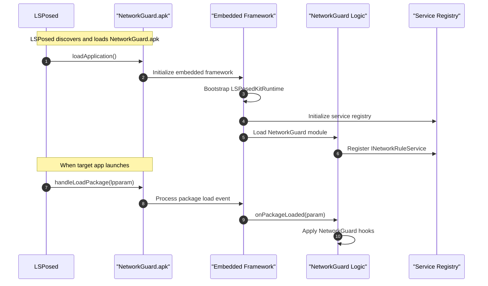
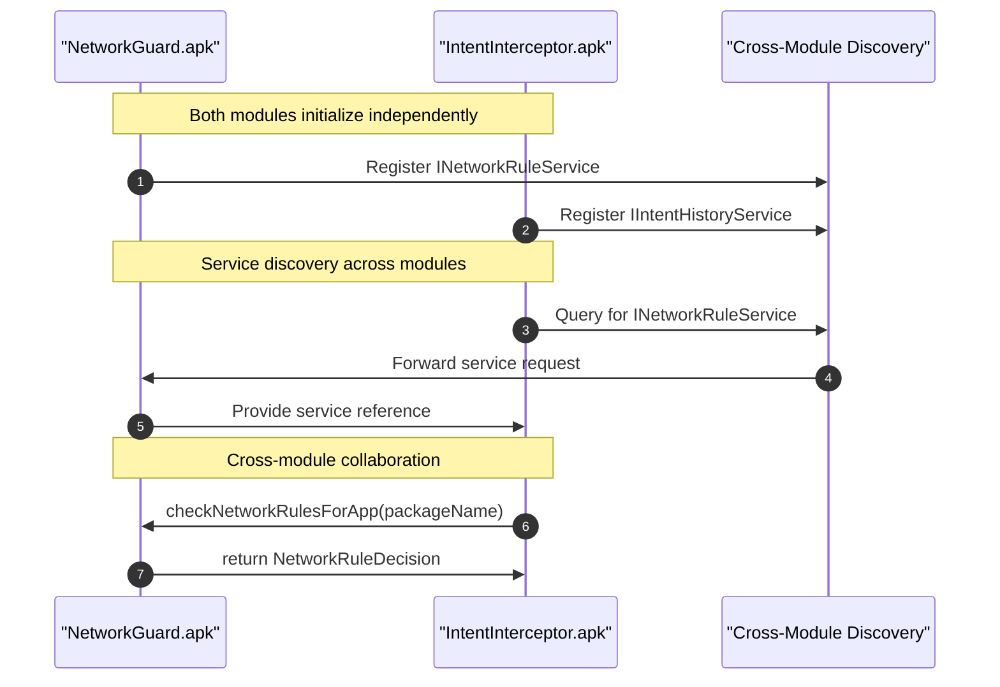
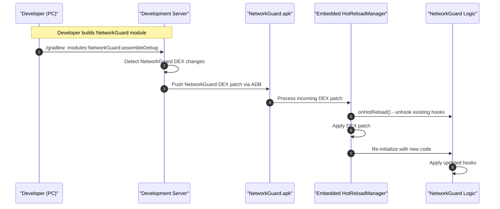

# Framework Internals

> A deep dive into the internal architecture of LSPosedKit's **embedded framework** layer, explaining how components interact within standalone module APKs and the design patterns used throughout the system.

## Embedded Framework Architecture

**Key Principle**: Each LSPosed module APK contains the complete LSPosedKit framework embedded within it, enabling standalone operation.

```
┌─────────────────────────────────────┐
│        NetworkGuard.apk             │
├─────────────────────────────────────┤
│ NetworkGuard Module Code            │
├─────────────────────────────────────┤
│ Embedded LSPosedKit Framework:      │
│ ├─ Core Runtime                     │
│ ├─ Service Registry                 │
│ ├─ Settings Management              │
│ ├─ Hot-Reload System                │
│ └─ Cross-Module Communication       │
└─────────────────────────────────────┘
```

## Package Architecture

The LSPosedKit framework is organized into several core packages, each embedded within every module:

| Package                         | Key classes                           | Role                      |
| ------------------------------- | ------------------------------------- | ------------------------- |
| `com.wobbz.framework.core`      | `LSPosedKitRuntime`, `IModulePlugin`  | Module bootstrap & core interfaces |
| `com.wobbz.framework.processor` | `XposedPluginProcessor`               | KAPT annotation processor |
| `com.wobbz.framework.hot`       | `HotReloadManager`, `DexPatcher`      | DEX patching & hot-reload |
| `com.wobbz.framework.settings`  | `SettingsProvider`, `SettingsStorage` | Module preference management |
| `com.wobbz.framework.service`   | `FeatureManager`, `ServiceRegistry`   | Cross-module communication |

## Initialization Sequence (Per Module)

When LSPosed loads a module APK, each module initializes its embedded framework independently:



## Cross-Module Communication

When multiple LSPosedKit modules are installed, they can communicate via their embedded service registries:



## Core Components (Embedded in Each Module)

### LSPosedKitRuntime (Per Module)

Each module contains its own instance of the runtime, responsible for:

- Integration with LSPosed framework (via generated `xposed_init`)
- Module-specific lifecycle management
- Package event handling for that module
- Hot-reload coordination for that module

```kotlin
class LSPosedKitRuntime : IXposedHookLoadPackage {
    private val modulePlugin: IModulePlugin
    private val serviceRegistry: ServiceRegistry
    private val hotReloadManager: HotReloadManager
    
    override fun handleLoadPackage(lpparam: XC_LoadPackage.LoadPackageParam) {
        // Check if this module targets the loaded package
        if (shouldProcessPackage(lpparam.packageName)) {
            val param = PackageLoadedParam(lpparam, xposedInterface)
            modulePlugin.onPackageLoaded(param)
        }
    }
    
    private fun shouldProcessPackage(packageName: String): Boolean {
        // Check @XposedPlugin scope configuration
        return scopeTargets.contains(packageName) || scopeTargets.contains("*")
    }
}
```

### ServiceRegistry (Per Module, Cross-Module Capable)

Each module contains an embedded service registry that provides:

1. **Internal Services**: Services specific to that module
2. **Cross-Module Discovery**: Ability to find services from other installed LSPosedKit modules

```kotlin
object FeatureManager {
    private val localRegistry = ConcurrentHashMap<Class<*>, Any>()
    private val crossModuleRegistry = CrossModuleServiceRegistry()
    
    fun <T : Any> register(serviceClass: Class<T>, implementation: T) {
        // Register locally
        localRegistry[serviceClass] = implementation
        
        // Make available for cross-module discovery
        crossModuleRegistry.advertise(serviceClass, implementation)
    }
    
    fun <T : Any> get(serviceClass: Class<T>): T? {
        // First check local registry
        val local = localRegistry[serviceClass] as? T
        if (local != null) return local
        
        // Then check other modules
        return crossModuleRegistry.discover(serviceClass)
    }
}
```

### XposedPluginProcessor (Build-Time, Per Module)

The annotation processor generates module-specific files during each module's build:

1. Processes `@XposedPlugin` annotations in the module
2. Generates metadata files specific to that module
3. Creates proper `xposed_init` entry point
4. Validates module configuration

Generated files per module:
```
modules/NetworkGuard/src/main/assets/
├── module.prop          ← LSPosed metadata for NetworkGuard
├── xposed_init          ← Entry point: com.wobbz.module.networkguard.XposedInit
├── module-info.json     ← Extended metadata for NetworkGuard
└── settings.json        ← Settings schema (manually authored)
```

## Hot-Reload Architecture (Per Module)

Each module contains its own hot-reload capabilities:

### HotReloadManager (Per Module)

Embedded in each module APK to handle:

1. DEX patch reception for that specific module
2. Module-specific reloading logic
3. Coordination with the module's `IHotReloadable` implementation

```kotlin
class HotReloadManager(private val modulePlugin: IModulePlugin) {
    
    fun handleHotReload(newDexBytes: ByteArray) {
        // Apply DEX patch for this module only
        val patcher = DexPatcher()
        patcher.applyPatch(newDexBytes)
        
        // Notify module of reload
        if (modulePlugin is IHotReloadable) {
            modulePlugin.onHotReload()
        }
        
        // Re-register services if needed
        reregisterModuleServices()
    }
}
```

### Development Server Integration

The development server can hot-reload specific modules:

```bash
# Start development server
./gradlew runDevServer

# Build specific module → triggers hot-reload for just that module
./gradlew :modules:NetworkGuard:assembleDebug
```

### Hot-Reload Sequence (Per Module)



## Settings Management (Per Module)

Each module has its own embedded settings system:

### SettingsProvider (Per Module)

```kotlin
class SettingsProvider(private val moduleId: String) {
    private val storage = SettingsStorage(moduleId)
    private val schema = loadSettingsSchema() // from assets/settings.json
    
    fun <T> getValue(key: String, defaultValue: T): T {
        return storage.getValue(key, defaultValue)
    }
    
    fun <T> setValue(key: String, value: T) {
        storage.setValue(key, value)
        notifySettingsChanged(key, value)
    }
}
```

### Settings UI Integration

Each module's settings are managed independently in LSPosed Manager:

```
LSPosed Manager → Modules
├── NetworkGuard → Settings (from NetworkGuard's settings.json)
├── IntentInterceptor → Settings (from IntentInterceptor's settings.json)
└── UIEnhancer → Settings (from UIEnhancer's settings.json)
```

## Module Lifecycle Management

### ModuleLifecycle Interface

Each module can implement lifecycle callbacks:

```kotlin
interface ModuleLifecycle {
    fun onStart()                    // Module activated in LSPosed Manager
    fun onStop()                     // Module deactivated
    fun onPackageLoaded(param: PackageLoadedParam)  // Target app loads
}
```

### Releasable Resources

Modules should implement `Releasable` for proper cleanup:

```kotlin
class NetworkGuard : IModulePlugin, ModuleLifecycle, Releasable {
    private val hooks = mutableListOf<MethodUnhooker<*>>()
    private val networkMonitor = NetworkMonitor()
    
    override fun onStop() {
        release()
    }
    
    override fun release() {
        hooks.forEach { it.unhook() }
        hooks.clear()
        networkMonitor.cleanup()
    }
}
```

## Memory and Performance Considerations

### Framework Overhead

Since each module embeds the framework:

- **Memory**: ~500KB framework overhead per module
- **Boot Time**: Minimal impact (framework lazy-loads)
- **Cross-Module Efficiency**: Service discovery uses minimal IPC

### Optimization Strategies

1. **Shared Framework Code**: Framework classes are identical across modules, enabling OS-level deduplication
2. **Lazy Initialization**: Framework components initialize only when needed
3. **Service Registry Cleanup**: Unused services are automatically garbage collected

## Key Benefits of Embedded Architecture

1. **Independence**: Each module is completely self-contained
2. **Isolation**: Module failures don't affect other modules
3. **Versioning**: Each module can embed different framework versions if needed
4. **Distribution**: Standard APK distribution with no external dependencies
5. **Development**: Hot-reload works per-module without affecting others

## Inter-Module Service Examples

### Network Rule Service (NetworkGuard)

```kotlin
interface INetworkRuleService {
    fun checkRule(packageName: String, url: String): NetworkDecision
    fun addRule(rule: NetworkRule)
}

// Implementation in NetworkGuard module
class NetworkRuleProvider : INetworkRuleService {
    override fun checkRule(packageName: String, url: String): NetworkDecision {
        // Check rules and return decision
    }
}

// Registration during NetworkGuard initialization
FeatureManager.register(INetworkRuleService::class.java, NetworkRuleProvider())
```

### Intent History Service (IntentInterceptor)

```kotlin
interface IIntentHistoryService {
    fun recordIntent(intent: Intent, sourcePackage: String)
    fun getIntentHistory(packageName: String): List<IntentRecord>
}

// Usage in another module
val historyService = FeatureManager.get(IIntentHistoryService::class.java)
historyService?.recordIntent(capturedIntent, sourcePackageName)
```

This embedded architecture provides the flexibility of traditional LSPosed modules while maintaining the simplicity of standalone APK distribution. 