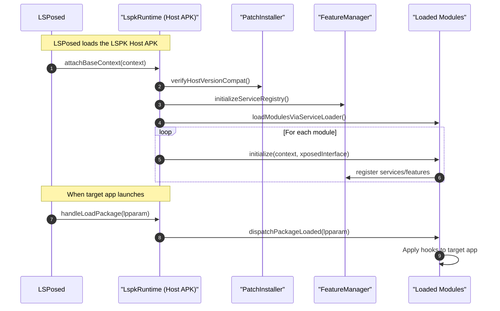
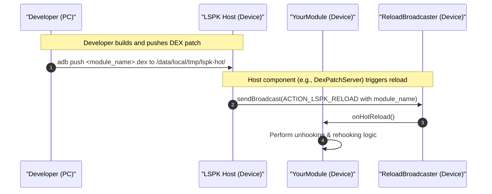

# Framework Internals

> A deep dive into the internal architecture of LSPosedKit's framework layer, explaining how components interact and the design patterns used throughout the system.

## Package Architecture

The LSPosedKit framework is organized into several core packages, each with a specific responsibility:

| Package                         | Key classes                           | Role                      |
| ------------------------------- | ------------------------------------- | ------------------------- |
| `com.wobbz.framework.core`      | `LspkRuntime`, `DexPatchServer`       | Host bootstrap & services |
| `com.wobbz.framework.processor` | `XposedPluginProcessor`               | KAPT annotation processor |
| `com.wobbz.framework.hot`       | `PatchInstaller`, `ReloadBroadcaster` | DexPatch plumbing         |
| `com.wobbz.framework.settings`  | `SettingsProvider`, `SettingsStore`   | Preference management     |
| `com.wobbz.framework.service`   | `FeatureManager`, `ServiceRegistry`   | Module interop & services |
| `com.wobbz.framework.util`      | `LogUtil`, `ReflectionHelper`         | Common utilities          |

## Initialization Sequence

When the system starts, LSPosedKit undergoes a structured initialization sequence:



## Core Components

### LspkRuntime

The central nervous system of LSPosedKit, `LspkRuntime` handles:

- Integration with LSPosed framework
- Module discovery, loading, and lifecycle management
- Package event dispatch to appropriate modules
- Hot-reload coordination

```java
public class LspkRuntime implements IXposedHookLoadPackage, IXposedHookZygoteInit {
    private final ModuleRegistry moduleRegistry;
    private final ServiceRegistry serviceRegistry;
    private final HotReloadManager hotReloadManager;
    
    @Override
    public void handleLoadPackage(XC_LoadPackage.LoadPackageParam lpparam) {
        // Find modules targeting this package
        for (ModuleInfo module : moduleRegistry.getModulesForPackage(lpparam.packageName)) {
            module.dispatch(new PackageLoadedParam(lpparam));
        }
    }
    
    @Override
    public void initZygote(StartupParam startupParam) {
        // Initialize system-wide hooks
    }
}
```

### ServiceRegistry & FeatureManager

The `ServiceRegistry` provides a lightweight dependency injection system that allows modules to expose services to each other:

```kotlin
object FeatureManager {
    private val registry = ConcurrentHashMap<Class<*>, Any>()
    
    fun <T : Any> register(serviceClass: Class<T>, implementation: T) {
        registry[serviceClass] = implementation
    }
    
    fun <T : Any> get(serviceClass: Class<T>): T? {
        @Suppress("UNCHECKED_CAST")
        return registry[serviceClass] as? T
    }
    
    fun hasFeature(featureId: String): Boolean {
        return features.contains(featureId)
    }
}
```

This enables modules to interact without direct dependencies:

```kotlin
// Provider module
class DebugAppProvider : IDebugProvider {
    override fun getRules(): List<DebugRule> = loadRules()
}

// Register during initialization
FeatureManager.register(IDebugProvider::class.java, DebugAppProvider())

// Consumer module
val provider = FeatureManager.get(IDebugProvider::class.java)
if (provider != null) {
    applyRules(provider.getRules())
}
```

### XposedPluginProcessor

The annotation processor plays a critical role in eliminating boilerplate:

1. Processes `@XposedPlugin` annotations at compile time
2. Generates metadata files for module discovery
3. Creates `ServiceLoader` entries for automatic loading
4. Validates module configuration for correctness

```kotlin
@AutoService(Processor::class)
class XposedPluginProcessor : AbstractProcessor() {
    override fun process(annotations: Set<TypeElement>, roundEnv: RoundEnvironment): Boolean {
        roundEnv.getElementsAnnotatedWith(XposedPlugin::class.java).forEach { element ->
            val annotation = element.getAnnotation(XposedPlugin::class.java)
            
            // Generate module metadata
            generateModuleMetadata(element, annotation)
            
            // Generate ServiceLoader entry
            generateServiceLoaderEntry(element)
        }
        
        return true
    }
}
```

## Hot-Reload Architecture

The hot-reload system consists of several collaborating components:

### DexPatchServer

A TCP server that runs on the development machine and:

1. Listens for connections from the device
2. Monitors module build outputs for changes
3. Computes DEX patches when changes occur
4. Pushes patches to the device
5. Triggers reload broadcasts

### PatchInstaller

On the device side, responsible for:

1. Receiving and validating DEX patches
2. Safely installing patches into the runtime
3. Managing patch filesystem storage
4. Coordinating with ReloadBroadcaster

### ReloadBroadcaster

Notifies modules when a reload is required:

```kotlin
class ReloadBroadcaster(private val context: Context) {
    fun broadcastReload(moduleId: String, force: Boolean = false) {
        val intent = Intent(ACTION_LSPK_RELOAD).apply {
            putExtra(EXTRA_MODULE_ID, moduleId)
            putExtra(EXTRA_FORCE, force)
        }
        context.sendBroadcast(intent)
    }
}
```

### Reload Sequence



## Settings Provider Architecture

The settings system consists of:

1. `SettingsStore`: Low-level persistence and retrieval
2. `SettingsProvider`: Type-safe API for accessing settings
3. `SettingsKey` annotation: For binding properties to settings

```kotlin
class SettingsProvider(private val store: SettingsStore) {
    fun bool(key: String, default: Boolean = false): Boolean {
        return store.getBoolean(key, default)
    }
    
    fun int(key: String, default: Int = 0): Int {
        return store.getInt(key, default)
    }
    
    fun <T : Any> bind(clazz: Class<T>): T {
        // Create proxy that maps annotated properties to settings
    }
}
```

The settings architecture follows a key-value store pattern with JSON Schema validation for type safety.

## ClassLoader Hierarchy

LSPosedKit carefully manages ClassLoader hierarchies to ensure proper class resolution:

```
BootClassLoader
    ↑
SystemClassLoader
    ↑
ApplicationClassLoader (LSPosed Host)
    ↑
ModuleClassLoader (Individual modules)
```

During hot-reload, a new ClassLoader is created with the patched DEX:

```
BootClassLoader
    ↑
SystemClassLoader
    ↑
ApplicationClassLoader
    ↑
ModuleClassLoader
    ↑
PatchedModuleClassLoader (contains updated classes)
```

## Error Handling & Logging

LSPosedKit implements a robust error handling strategy:

1. **Compartmentalization**: Module errors are isolated and don't crash other modules
2. **Graceful Degradation**: System continues functioning if components fail
3. **Detailed Logging**: Comprehensive logging with tagged output
4. **Error Boundaries**: Critical paths are wrapped in try-catch with fallbacks

```kotlin
class ErrorBoundary {
    fun <T> runCatching(operation: () -> T, fallback: T, logger: LogUtil): T {
        return try {
            operation()
        } catch (e: Throwable) {
            logger.error("Operation failed", e)
            fallback
        }
    }
}
```

## Advanced Integration Points

### Xposed Integration

LSPosedKit exposes a simpler API that wraps Xposed complexity:

```kotlin
interface XposedInterface {
    fun loadClass(name: String): Class<*>
    
    fun <T : Hooker> hook(method: Method, hooker: Class<T>): MethodUnhooker<T>
    
    fun log(level: LogLevel, message: String)
}
```

### Resource Injection

For modules that need to modify resources:

```kotlin
class ResourceHelper(private val resparam: XC_InitPackageResources.InitPackageResourcesParam) {
    fun replaceLayout(layoutId: Int, newLayoutResId: Int) {
        resparam.res.setReplacement(
            resparam.packageName,
            "layout",
            layoutId,
            newLayoutResId
        )
    }
}
```

## Thread Safety Considerations

LSPosedKit is designed for concurrent execution with:

- Thread-safe collections (`ConcurrentHashMap`, etc.)
- Immutable data structures where possible
- Explicit synchronization when required
- Thread-local storage for context-specific data

```kotlin
object ThreadLocalContext {
    private val currentPackage = ThreadLocal<String>()
    
    fun setPackage(packageName: String) {
        currentPackage.set(packageName)
    }
    
    fun getCurrentPackage(): String? {
        return currentPackage.get()
    }
    
    fun clear() {
        currentPackage.remove()
    }
}
```

## Performance Optimization

Key performance optimizations include:

1. **Lazy Loading**: Components are initialized on demand
2. **Targeted Hooks**: Modules only hook into specified packages
3. **Resource Pooling**: Connection and thread pools for shared resources
4. **Caching**: Frequently accessed data is cached
5. **Minimal Reflection**: Reflection usage is minimized and results cached

## Advanced: Extending the Framework

For developers who want to extend LSPosedKit itself:

1. **Custom Annotation Processors**: Extend `XposedPluginProcessor`
2. **Service Providers**: Implement and register new services
3. **Event Listeners**: Create listeners for framework events
4. **Custom ClassLoaders**: Extend module loading behavior

## Best Practices for Framework Integration

1. **Respect API Boundaries**: Use public APIs, avoid reflection on internals
2. **Error Handling**: Always handle exceptions in your hooks
3. **Resource Cleanup**: Release resources when modules are disabled
4. **Thread Safety**: Assume your code will run in multiple threads
5. **Lightweight Initialization**: Keep module startup fast and efficient

## Appendix: Key Class Relationships

```mermaid
classDiagram
    class LspkRuntime {
        +handleLoadPackage()
        +initZygote()
    }
    
    class ModuleRegistry {
        +loadModules()
        +getModulesForPackage()
    }
    
    class IModulePlugin {
        +initialize()
        +onPackageLoaded()
    }
    
    class HotReloadManager {
        +installPatch()
        +broadcastReload()
    }
    
    class IHotReloadable {
        +onHotReload()
    }
    
    class FeatureManager {
        +register()
        +get()
        +hasFeature()
    }
    
    LspkRuntime --> ModuleRegistry
    LspkRuntime --> HotReloadManager
    ModuleRegistry --> IModulePlugin
    HotReloadManager --> IHotReloadable
    IModulePlugin --> FeatureManager
</rewritten_file> 