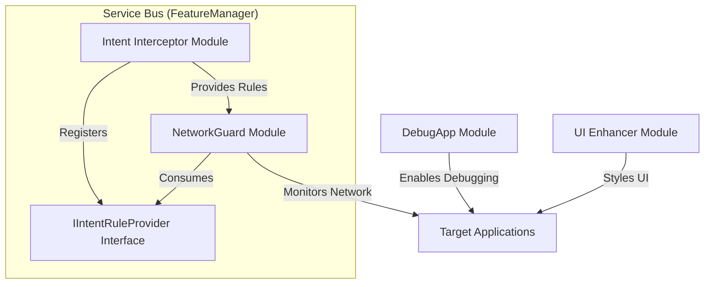

# End-to-End Module Examples

> Complete walkthrough of real-world module implementations demonstrating common patterns, best practices, and advanced techniques.

## Example 1: DebugApp Module

A module that enables debugging for target applications by setting the `FLAG_DEBUGGABLE` flag in their `ApplicationInfo`.

### Implementation

```kotlin
package com.example.debugapp

import android.content.Context
import android.content.pm.ApplicationInfo
import com.wobbz.framework.core.IModulePlugin
import com.wobbz.framework.hot.IHotReloadable
import com.wobbz.framework.processor.HotReloadable
import com.wobbz.framework.processor.XposedPlugin

@XposedPlugin(
    id = "debug-app",
    name = "Debug App",
    version = "1.0.0",
    scope = ["*"],
    description = "Force-enable debugging flags for all applications",
    author = "LSPosedKit Team"
)
@HotReloadable
class DebugApp : IModulePlugin, IHotReloadable {
    private val hooks = mutableListOf<XposedInterface.MethodUnhooker<*>>()
    
    override fun initialize(context: Context, xposed: XposedInterface) {
        xposed.log(LogLevel.INFO, "DebugApp initialized")
    }
    
    override fun onPackageLoaded(param: PackageLoadedParam) {
        param.xposed.log(LogLevel.INFO, "Hooking package: ${param.packageName}")
        
        // Hook ApplicationInfo.flags field getter
        param.xposed.loadClass("android.content.pm.ApplicationInfo").let { clazz ->
            clazz.getDeclaredField("flags").apply {
                isAccessible = true
                hooks += param.xposed.hook(getter = this, hooker = DebugFlagHooker::class.java)
            }
        }
    }
    
    override fun onHotReload() {
        // Clean up existing hooks when hot-reloaded
        hooks.forEach { it.unhook() }
        hooks.clear()
    }
    
    class DebugFlagHooker : Hooker {
        override fun afterHook(param: HookParam) {
            // Get the current flags and add FLAG_DEBUGGABLE
            val currentFlags = param.getResult<Int>()
            val newFlags = currentFlags or ApplicationInfo.FLAG_DEBUGGABLE
            
            // Set the modified flags as the result
            param.setResult(newFlags)
        }
    }
}
```

### Module Settings (settings.json)

```json
{
  "$schema": "https://json-schema.org/draft-07/schema#",
  "type": "object",
  "properties": {
    "enableDebug": {
      "type": "boolean",
      "title": "Enable Debugging",
      "description": "Master switch for enabling debug flags",
      "default": true
    },
    "excludedPackages": {
      "type": "array",
      "title": "Excluded Packages",
      "description": "Package names to exclude from debugging",
      "items": {
        "type": "string"
      },
      "default": []
    },
    "logLevel": {
      "type": "string",
      "title": "Log Level",
      "enum": ["OFF", "INFO", "DEBUG", "VERBOSE"],
      "default": "INFO"
    }
  }
}
```

### Module Info (module-info.json)

```json
{
  "$schema": "https://json-schema.org/draft-07/schema#",
  "id": "debug-app",
  "version": "1.0.0",
  "features": [
    "app.debugging"
  ]
}
```

### Key Implementation Points

1. **Global Scope**: Uses `["*"]` to target all applications
2. **Field Hooking**: Hooks a field getter to modify its value
3. **Hot-Reload Support**: Properly maintains and cleans up hook references
4. **Settings**: Provides configuration options via settings.json

## Example 2: NetworkGuard Module

A module that monitors and blocks network connections based on configurable rules.

### Implementation

```kotlin
package com.example.networkguard

import android.content.Context
import com.wobbz.framework.core.IModulePlugin
import com.wobbz.framework.hot.IHotReloadable
import com.wobbz.framework.processor.HotReloadable
import com.wobbz.framework.processor.XposedPlugin
import com.wobbz.framework.settings.SettingsProvider
import java.net.Socket

@XposedPlugin(
    id = "network-guard",
    name = "Network Guard",
    version = "1.0.0",
    scope = ["*"],
    description = "Monitor and block network connections",
    author = "LSPosedKit Team"
)
@HotReloadable
class NetworkGuard : IModulePlugin, IHotReloadable {
    private val hooks = mutableListOf<XposedInterface.MethodUnhooker<*>>()
    private lateinit var settings: SettingsProvider
    
    override fun initialize(context: Context, xposed: XposedInterface) {
        settings = SettingsProvider.of(context)
        xposed.log(LogLevel.INFO, "NetworkGuard initialized")
    }
    
    override fun onPackageLoaded(param: PackageLoadedParam) {
        val xposed = param.xposed
        xposed.log(LogLevel.INFO, "Hooking network for: ${param.packageName}")
        
        // Hook Socket constructor to monitor/block connections
        val socketClass = xposed.loadClass("java.net.Socket")
        val constructor = socketClass.getDeclaredConstructor(String::class.java, Int::class.javaPrimitiveType)
        hooks += xposed.hook(constructor, SocketHooker::class.java)
        
        // Hook URL.openConnection to monitor HTTP(S) connections
        val urlClass = xposed.loadClass("java.net.URL")
        val openConnection = urlClass.getDeclaredMethod("openConnection")
        hooks += xposed.hook(openConnection, UrlConnectionHooker::class.java)
    }
    
    override fun onHotReload() {
        hooks.forEach { it.unhook() }
        hooks.clear()
    }
    
    class SocketHooker : Hooker {
        override fun beforeHook(param: HookParam) {
            val host = param.args[0] as String
            val port = param.args[1] as Int
            
            // Get settings provider
            val settings = SettingsProvider.of(null)
            
            // Check if monitoring is enabled
            if (!settings.bool("monitorConnections", true)) {
                return
            }
            
            // Log the connection attempt
            val log = settings.bool("logConnections", true)
            if (log) {
                param.thisObject?.javaClass?.classLoader?.let { classLoader ->
                    val context = getContextFromClassLoader(classLoader)
                    context?.let {
                        val xposed = XposedBridge.getXposedInterface(it)
                        xposed?.log(LogLevel.INFO, "Socket connection: $host:$port")
                    }
                }
            }
            
            // Get blocked hosts from settings
            val blockedHosts = settings.stringList("blockedHosts", emptyList())
            
            // Block if host is in the blocked list
            if (blockedHosts.any { host.contains(it) }) {
                param.setThrowable(SecurityException("Connection to $host:$port blocked by NetworkGuard"))
            }
        }
        
        private fun getContextFromClassLoader(classLoader: ClassLoader): Context? {
            // Implementation to get context from ClassLoader
            // This is a simplified example - actual implementation would be more complex
            return null
        }
    }
    
    class UrlConnectionHooker : Hooker {
        override fun beforeHook(param: HookParam) {
            val url = param.thisObject.toString()
            
            // Get settings provider
            val settings = SettingsProvider.of(null)
            
            // Check if monitoring is enabled
            if (!settings.bool("monitorConnections", true)) {
                return
            }
            
            // Log the connection attempt
            val log = settings.bool("logConnections", true)
            if (log) {
                param.thisObject?.javaClass?.classLoader?.let { classLoader ->
                    val context = getContextFromClassLoader(classLoader)
                    context?.let {
                        val xposed = XposedBridge.getXposedInterface(it)
                        xposed?.log(LogLevel.INFO, "URL connection: $url")
                    }
                }
            }
            
            // Get blocked URLs from settings
            val blockedUrls = settings.stringList("blockedUrls", emptyList())
            
            // Block if URL is in the blocked list
            if (blockedUrls.any { url.contains(it) }) {
                param.setThrowable(SecurityException("Connection to $url blocked by NetworkGuard"))
            }
        }
        
        private fun getContextFromClassLoader(classLoader: ClassLoader): Context? {
            // Implementation to get context from ClassLoader
            return null
        }
    }
}
```

### Module Settings (settings.json)

```json
{
  "$schema": "https://json-schema.org/draft-07/schema#",
  "type": "object",
  "properties": {
    "monitorConnections": {
      "type": "boolean",
      "title": "Monitor Connections",
      "description": "Enable network connection monitoring",
      "default": true
    },
    "logConnections": {
      "type": "boolean",
      "title": "Log Connections",
      "description": "Log all network connections",
      "default": true
    },
    "blockedHosts": {
      "type": "array",
      "title": "Blocked Hosts",
      "description": "Hosts to block connections to",
      "items": {
        "type": "string"
      },
      "default": ["ads.example.com", "tracker.example.com"]
    },
    "blockedUrls": {
      "type": "array",
      "title": "Blocked URLs",
      "description": "URLs to block connections to",
      "items": {
        "type": "string"
      },
      "default": ["https://ads.example.com", "https://tracker.example.com"]
    }
  }
}
```

### Module Info (module-info.json)

```json
{
  "$schema": "https://json-schema.org/draft-07/schema#",
  "id": "network-guard",
  "version": "1.0.0",
  "features": [
    "network.monitoring",
    "network.blocking"
  ]
}
```

### Key Implementation Points

1. **Constructor Hooking**: Hooks Socket constructor to intercept network connections
2. **Method Hooking**: Hooks URL.openConnection to monitor HTTP requests
3. **Settings Integration**: Uses settings for configuration of blocking rules
4. **Exception Throwing**: Uses `setThrowable` to prevent connections to blocked hosts

## Example 3: Intent Interceptor Module

A module that intercepts and manipulates intents across the system.

### Implementation

```kotlin
package com.example.intentinterceptor

import android.content.Context
import android.content.Intent
import com.wobbz.framework.core.IModulePlugin
import com.wobbz.framework.hot.IHotReloadable
import com.wobbz.framework.processor.HotReloadable
import com.wobbz.framework.processor.XposedPlugin
import com.wobbz.framework.service.FeatureManager
import com.wobbz.framework.settings.SettingsProvider

// Interface for rule providers
interface IIntentRuleProvider {
    fun getRules(): List<IntentRule>
}

// Rule data class
data class IntentRule(
    val action: String,
    val type: String,
    val replacement: Intent? = null
)

@XposedPlugin(
    id = "intent-interceptor",
    name = "Intent Interceptor",
    version = "1.0.0",
    scope = ["android", "com.android.systemui"],
    description = "Intercept and modify system intents",
    author = "LSPosedKit Team"
)
@HotReloadable
class IntentInterceptor : IModulePlugin, IHotReloadable, IIntentRuleProvider {
    private val hooks = mutableListOf<XposedInterface.MethodUnhooker<*>>()
    private lateinit var settings: SettingsProvider
    private val rules = mutableListOf<IntentRule>()
    
    override fun initialize(context: Context, xposed: XposedInterface) {
        settings = SettingsProvider.of(context)
        loadRules()
        
        // Register as a rule provider for other modules
        FeatureManager.register(IIntentRuleProvider::class.java, this)
        
        xposed.log(LogLevel.INFO, "IntentInterceptor initialized with ${rules.size} rules")
    }
    
    private fun loadRules() {
        // Load rules from settings
        val rulesJson = settings.string("rules", "[]")
        
        // Parse JSON to rules (simplified example)
        // In real implementation, use a proper JSON parser
        if (rulesJson.isNotEmpty() && rulesJson != "[]") {
            // Parse rules and add to the rules list
            // Example rule: {"action": "android.intent.action.VIEW", "type": "BLOCK"}
        }
    }
    
    override fun getRules(): List<IntentRule> {
        return rules.toList() // Return immutable copy
    }
    
    override fun onPackageLoaded(param: PackageLoadedParam) {
        val xposed = param.xposed
        
        // Hook Activity.startActivity
        val activityClass = xposed.loadClass("android.app.Activity")
        val startActivity = activityClass.getDeclaredMethod("startActivity", Intent::class.java)
        hooks += xposed.hook(startActivity, StartActivityHooker::class.java)
        
        // Hook Context.startActivity
        val contextClass = xposed.loadClass("android.content.Context")
        val contextStartActivity = contextClass.getDeclaredMethod("startActivity", Intent::class.java)
        hooks += xposed.hook(contextStartActivity, StartActivityHooker::class.java)
    }
    
    override fun onHotReload() {
        hooks.forEach { it.unhook() }
        hooks.clear()
        
        // Reload rules on hot-reload
        loadRules()
    }
    
    class StartActivityHooker : Hooker {
        override fun beforeHook(param: HookParam) {
            val intent = param.args[0] as Intent
            val action = intent.action ?: return
            
            // Get rule provider
            val ruleProvider = FeatureManager.get(IIntentRuleProvider::class.java) ?: return
            
            // Apply rules
            for (rule in ruleProvider.getRules()) {
                if (rule.action == action) {
                    when (rule.type) {
                        "BLOCK" -> {
                            // Block the intent
                            param.setResult(null)
                            return
                        }
                        "REPLACE" -> {
                            // Replace with another intent
                            rule.replacement?.let { replacement ->
                                param.args[0] = replacement
                            }
                        }
                        "LOG" -> {
                            // Just log the intent
                            param.thisObject?.javaClass?.classLoader?.let { classLoader ->
                                val context = getContextFromClassLoader(classLoader)
                                context?.let {
                                    val xposed = XposedBridge.getXposedInterface(it)
                                    xposed?.log(LogLevel.INFO, "Intent intercepted: $action")
                                }
                            }
                        }
                    }
                }
            }
        }
        
        private fun getContextFromClassLoader(classLoader: ClassLoader): Context? {
            // Implementation to get context from ClassLoader
            return null
        }
    }
}
```

### Module Settings (settings.json)

```json
{
  "$schema": "https://json-schema.org/draft-07/schema#",
  "type": "object",
  "properties": {
    "enabled": {
      "type": "boolean",
      "title": "Enable Interception",
      "description": "Master switch for intent interception",
      "default": true
    },
    "rules": {
      "type": "string",
      "title": "Intent Rules (JSON)",
      "description": "JSON array of intent interception rules",
      "default": "[{\"action\":\"android.intent.action.VIEW\",\"type\":\"LOG\"}]"
    },
    "logLevel": {
      "type": "string",
      "title": "Log Level",
      "enum": ["OFF", "INFO", "DEBUG", "VERBOSE"],
      "default": "INFO"
    }
  }
}
```

### Module Info (module-info.json)

```json
{
  "$schema": "https://json-schema.org/draft-07/schema#",
  "id": "intent-interceptor",
  "version": "1.0.0",
  "features": [
    "intent.interception",
    "intent.modification"
  ],
  "extensions": {
    "intent.rule.provider": "com.example.intentinterceptor.IntentInterceptor"
  }
}
```

### Key Implementation Points

1. **Service Provider**: Implements and registers an interface for other modules
2. **Multiple Hook Points**: Hooks multiple methods that handle intents
3. **Dynamic Configuration**: Loads rules from settings
4. **Extension Point**: Declares an extension point in module-info.json

## Example 4: UI Enhancer Module

A module that enhances the UI of target applications by modifying layouts and views.

### Implementation

```kotlin
package com.example.uienhancer

import android.content.Context
import android.view.View
import android.widget.TextView
import com.wobbz.framework.core.IModulePlugin
import com.wobbz.framework.hot.IHotReloadable
import com.wobbz.framework.processor.HotReloadable
import com.wobbz.framework.processor.XposedPlugin
import com.wobbz.framework.settings.SettingsKey
import com.wobbz.framework.settings.SettingsProvider

// Settings class with annotated properties
class UIEnhancerSettings(
    @SettingsKey("enableCustomColors") val enableCustomColors: Boolean = true,
    @SettingsKey("primaryColor") val primaryColor: String = "#3F51B5",
    @SettingsKey("textSize") val textSize: Int = 14,
    @SettingsKey("cornerRadius") val cornerRadius: Int = 8,
    @SettingsKey("targetViews") val targetViews: List<String> = listOf("TextView", "Button")
)

@XposedPlugin(
    id = "ui-enhancer",
    name = "UI Enhancer",
    version = "1.0.0",
    scope = ["com.android.settings", "com.android.systemui"],
    description = "Enhance UI elements with custom styling",
    author = "LSPosedKit Team"
)
@HotReloadable
class UIEnhancer : IModulePlugin, IHotReloadable {
    private val hooks = mutableListOf<XposedInterface.MethodUnhooker<*>>()
    private lateinit var settings: UIEnhancerSettings
    
    override fun initialize(context: Context, xposed: XposedInterface) {
        // Bind settings class
        val provider = SettingsProvider.of(context)
        settings = provider.bind(UIEnhancerSettings::class.java)
        
        xposed.log(LogLevel.INFO, "UI Enhancer initialized")
    }
    
    override fun onPackageLoaded(param: PackageLoadedParam) {
        val xposed = param.xposed
        
        // Hook View.onFinishInflate to modify views after inflation
        val viewClass = xposed.loadClass("android.view.View")
        val onFinishInflate = viewClass.getDeclaredMethod("onFinishInflate")
        hooks += xposed.hook(onFinishInflate, ViewInflateHooker::class.java)
        
        // Hook TextView constructor to modify text views
        if (settings.targetViews.contains("TextView")) {
            val textViewClass = xposed.loadClass("android.widget.TextView")
            val constructor = textViewClass.getDeclaredConstructor(Context::class.java)
            hooks += xposed.hook(constructor, TextViewHooker::class.java)
        }
    }
    
    override fun onHotReload() {
        hooks.forEach { it.unhook() }
        hooks.clear()
    }
    
    class ViewInflateHooker : Hooker {
        override fun afterHook(param: HookParam) {
            val view = param.thisObject as View
            
            // Get settings
            val provider = SettingsProvider.of(view.context)
            val settings = provider.bind(UIEnhancerSettings::class.java)
            
            if (!settings.enableCustomColors) {
                return
            }
            
            // Apply custom styling based on view type
            when (view) {
                is TextView -> {
                    // Set text size
                    view.textSize = settings.textSize.toFloat()
                    
                    // Set text color if it's a primary text view
                    if (view.id == android.R.id.text1 || view.id == android.R.id.title) {
                        try {
                            val color = android.graphics.Color.parseColor(settings.primaryColor)
                            view.setTextColor(color)
                        } catch (e: Exception) {
                            // Handle invalid color format
                        }
                    }
                }
            }
        }
    }
    
    class TextViewHooker : Hooker {
        override fun afterHook(param: HookParam) {
            val textView = param.thisObject as TextView
            val context = param.args[0] as Context
            
            // Get settings
            val provider = SettingsProvider.of(context)
            val settings = provider.bind(UIEnhancerSettings::class.java)
            
            if (!settings.enableCustomColors) {
                return
            }
            
            // Set text size
            textView.textSize = settings.textSize.toFloat()
        }
    }
}
```

### Module Settings (settings.json)

```json
{
  "$schema": "https://json-schema.org/draft-07/schema#",
  "type": "object",
  "properties": {
    "enableCustomColors": {
      "type": "boolean",
      "title": "Enable Custom Colors",
      "description": "Apply custom color styling",
      "default": true
    },
    "primaryColor": {
      "type": "string",
      "title": "Primary Color",
      "description": "Primary color in hex format",
      "default": "#3F51B5",
      "pattern": "^#[0-9A-Fa-f]{6}$"
    },
    "textSize": {
      "type": "integer",
      "title": "Text Size",
      "description": "Base text size in sp",
      "minimum": 8,
      "maximum": 24,
      "default": 14
    },
    "cornerRadius": {
      "type": "integer",
      "title": "Corner Radius",
      "description": "Corner radius for buttons and cards in dp",
      "minimum": 0,
      "maximum": 16,
      "default": 8
    },
    "targetViews": {
      "type": "array",
      "title": "Target Views",
      "description": "View types to apply styling to",
      "items": {
        "type": "string",
        "enum": ["TextView", "Button", "EditText", "CheckBox", "RadioButton"]
      },
      "default": ["TextView", "Button"]
    }
  }
}
```

### Module Info (module-info.json)

```json
{
  "$schema": "https://json-schema.org/draft-07/schema#",
  "id": "ui-enhancer",
  "version": "1.0.0",
  "features": [
    "ui.styling",
    "ui.theming"
  ]
}
```

### Key Implementation Points

1. **Settings Binding**: Uses `@SettingsKey` annotation to bind settings class
2. **View Hooking**: Hooks view inflation to modify UI elements
3. **Constructor Hooking**: Hooks TextView constructor to apply styling
4. **Scoped Targeting**: Targets specific system applications

## Combining Multiple Modules

LSPosedKit enables powerful interactions between modules. Here's an example of how multiple modules can work together:



This architecture allows modules to:

1. **Share functionality** through interfaces
2. **Extend capabilities** of other modules
3. **Coordinate actions** across the system
4. **Maintain independence** while collaborating

## Best Practices Summary

From these examples, we can extract these key best practices:

1. **Hook Management**: Always store and clean up hook references
2. **Settings Integration**: Use typed settings with validation
3. **Hot-Reload Support**: Implement `IHotReloadable` for development speed
4. **Service Interfaces**: Use FeatureManager for cross-module communication
5. **Targeted Scoping**: Only hook into packages you need
6. **Error Handling**: Add proper exception handling and logging
7. **Clean Architecture**: Separate concerns with clear class responsibilities
8. **Documentation**: Include clear comments and documentation 