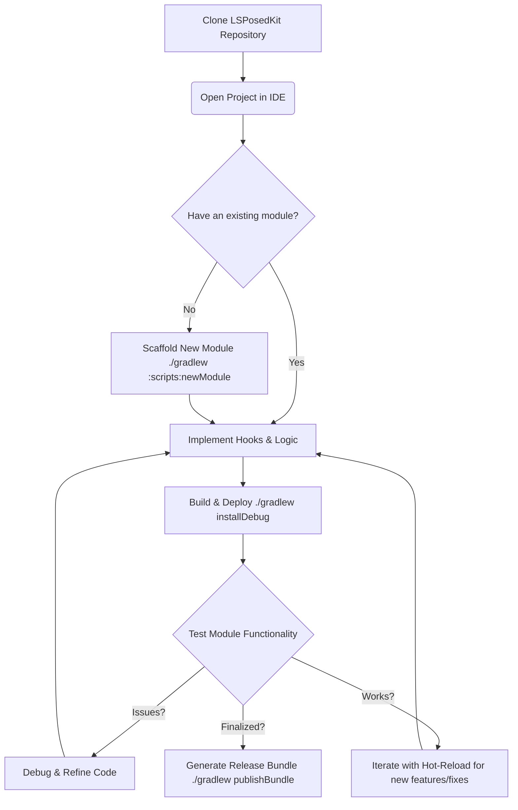

# LSPosedKit

[](https://github.com/your-org/LSPosedKit/actions)
[](LICENSE)

> A zero‑boilerplate, Android 15–ready toolkit for building, testing, and hot‑reloading LSPosed modules.

---

## Table of Contents

1. [Why LSPosedKit?](#why-lsposedkit)
2. [Features](#features)
3. [Project Layout](#project-layout)
4. [Quick Start](#quick-start)
5. [Visual Workflow Summary](#visual-workflow-summary)
6. [Supported Environments](#supported-environments)
7. [Advanced Usage](#advanced-usage)
8. [Contributing](#contributing)
9. [License](#license)

---

## Why LSPosedKit?

| Pain Point                           | LSPosedKit Benefit                                                                      |
| ------------------------------------ | --------------------------------------------------------------------------------------- |
| Chasing `libxposed-api` AARs         | Bundled **local source** ensures consistent APIs                                        |
| Manual `module.prop` & `xposed_init` | **Annotations** (`@XposedPlugin`) replace boilerplate (See [Docs/02-annotations.md](Docs/02-annotations.md)) |
| Reboot for every change              | **Hot‑Reload** patches DEX in <2 s—no reboot needed (See [Docs/06-hot-reload.md](Docs/06-hot-reload.md))    |
| DIY settings screens                 | **Declarative** `settings.json` → Manager UI (See [Docs/03-settings-schema.md](Docs/03-settings-schema.md))      |
| Fragmented utilities                 | Central **framework/** layer with services & logs (Explore in [Docs/07-framework-internals.md](Docs/07-framework-internals.md)) |

---

## Features

* **Annotation‑Driven Modules**: Define ID, version, scope, description, author in code. (See [Docs/02-annotations.md](Docs/02-annotations.md))
* **True Hot‑Reload**: Incremental DEX patching via ART 15's DexPatch. (See [Docs/06-hot-reload.md](Docs/06-hot-reload.md))
* **Declarative Settings**: `settings.json` → fully typed PreferenceScreen. (See [Docs/03-settings-schema.md](Docs/03-settings-schema.md))
* **Module Dependency Graph**: `module-info.json` with SemVer checks. (See [Docs/04-module-info-schema.md](Docs/04-module-info-schema.md))
* **Built‑In CI/CD**: GitHub Actions & GitLab templates under `Docs/`. (Templates and setup discussed in [Docs/12-testing-ci.md](Docs/12-testing-ci.md))
* **First‑Class Testing**: JUnit + Robolectric unit tests and connected‑device tests. (See [Docs/12-testing-ci.md](Docs/12-testing-ci.md))

---

## Project Layout

```text
LSPosedKit/
├── framework/                # Core runtime, annotation processor, hot-reload daemon
├── libxposed-api/            # Local source of libxposed-api (api/)
├── modules/                  # One sub-project per feature module
│   ├── DebugApp/             # Sample module
│   │   ├── src/
│   │   │   └── main/
│   │   │       ├── java/     # Kotlin/Java sources
│   │   │       └── assets/   # Contains module-info.json, settings.json
│   │   └── build.gradle      # Module-specific build script
│   └── …                     # Other modules
├── Docs/                     # Reference docs (schemas, guides, examples)
├── scripts/                  # Utility scripts (e.g. newModule)
├── build.gradle              # Root Gradle config (SDK 35, Java 17)
└── settings.gradle           # Includes :framework, :libxposed-api:api, :modules/*
```

---

## Quick Start

1. **Clone & initialize**

   ```bash
   git clone https://github.com/your-org/LSPosedKit.git
   cd LSPosedKit
   git submodule update --init --recursive
   ```
2. **Open in IDE**
   Import in Android Studio (Hedgehog Canary 15) or use Cursor.ai
3. **Scaffold a new module**

   ```bash
   ./gradlew :scripts:newModule -Pname="DebugApp" -Pid=debug-app
   ```
4. **Implement your hooks**

   ```kotlin
   @XposedPlugin(
     id          = "debug-app",
     name        = "Debug App",
     version     = "1.0.0",
     description = "Force-enable debug flags in target apps",
     scope       = ["*"]
   )
   @HotReloadable
   class DebugApp : IModulePlugin, IHotReloadable {
     private val hooks = mutableListOf<MethodUnhooker<*>>()

     override fun onPackageLoaded(p: PackageLoadedParam) {
       p.xposed.loadClass("android.app.ApplicationInfo").let { clazz ->
         clazz.getDeclaredField("flags").apply {
           isAccessible = true
           hooks += p.xposed.hook(getter = this, hooker = DebugHooker::class.java)
         }
       }
     }

     override fun onHotReload() {
       hooks.forEach { it.unhook() }
       hooks.clear()
     }

     class DebugHooker : Hooker {
       override fun afterHook(param: HookParam) {
         val flags = param.getResult<Int>() or ApplicationInfo.FLAG_DEBUGGABLE
         param.setResult(flags)
       }
     }
   }
   ```
5. **Build & deploy**

   ```bash
   ./gradlew assembleDebug installDebug
   ```

   * **Hot‑Reload**: save changes & rerun `installDebug`—hooks update instantly.
   * **Activation**: After installing, remember to activate the **LSPK Host** module and your new module (e.g., "DebugApp") in the LSPosed Manager app, then reboot your device.

---

## Visual Workflow Summary



---

## Supported Environments

| Component           | Version                                                       | Notes                                  |
| ------------------- | ------------------------------------------------------------- | -------------------------------------- |
| Android OS          | 15 (API 35)                                                   | Primary target, optimized for ART 15.0 |
|                     | 14 (API 34)                                                   | Full support with hot-reload           |
|                     | 13 (API 33)                                                   | Full support with hot-reload           |
|                     | 12 (API 31-32)                                                | Compatible, limited hot-reload         |
| JDK                 | 17 (Temurin/Eclipse Adoptium recommended)                     | Required minimum                       |
|                     | 21 (optional)                                                 | Enable with `-Pjava21` flag            |
| Kotlin              | 1.9+                                                          | Recommended for module development     |
| Gradle              | 8.4+                                                          | Required for Android 15 support        |
| Android Gradle Plugin | 8.3+                                                          | Required for proper DEX generation     |
| LSPosed Manager     | v1.9.0+                                                       | Required for module management         |

---

## Advanced Usage

* **Run DexPatch daemon**: ````bash ./gradlew runDevServer ```` (More in [Docs/06-hot-reload.md](Docs/06-hot-reload.md))
* **Generate bundles**: ````bash ./gradlew publishBundle ```` (More in [Docs/13-packaging.md](Docs/13-packaging.md))
* **Testing** (More in [Docs/12-testing-ci.md](Docs/12-testing-ci.md)):
  * Unit: ````bash ./gradlew testDebug ````
  * Device: ````bash ./gradlew connectedDebugAndroidTest ````

See **Docs/** for migration guides, general CLI references ([Docs/05-cli-gradle.md](Docs/05-cli-gradle.md)), API cheatsheets ([Docs/08-api-reference.md](Docs/08-api-reference.md)), CI templates, and troubleshooting ([Docs/15-troubleshooting.md](Docs/15-troubleshooting.md), [Docs/16-faq.md](Docs/16-faq.md)).

---

## Contributing

1. Fork & `git checkout -b feature/YourIdea`
2. Implement changes + tests + docs per **Docs/CONTRIBUTING.md**
3. Run `./gradlew lint test assembleDebug`
4. Submit a PR—CI will validate your work.

---

## License

WOBBZ License — see [LICENSE](LICENSE) for details.
