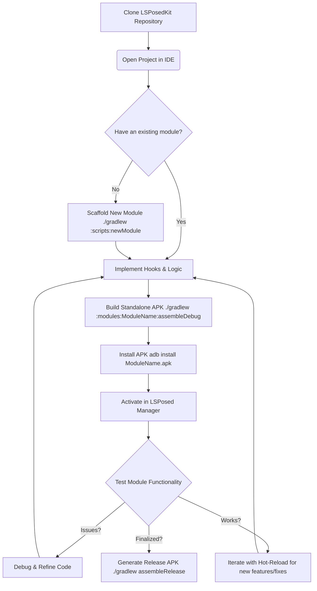

# LSPosedKit

[](https://github.com/your-org/LSPosedKit/actions)
[](LICENSE)

> A zero‑boilerplate, Android 15–ready toolkit for building, testing, and hot‑reloading **standalone LSPosed module APKs**.

---

## Table of Contents

1. [Why LSPosedKit?](#why-lsposedkit)
2. [Features](#features)
3. [Architecture](#architecture)
4. [Project Layout](#project-layout)
5. [Quick Start](#quick-start)
6. [Visual Workflow Summary](#visual-workflow-summary)
7. [Supported Environments](#supported-environments)
8. [Advanced Usage](#advanced-usage)
9. [Contributing](#contributing)
10. [License](#license)

---

## Why LSPosedKit?

| Pain Point                           | LSPosedKit Benefit                                                                      |
| ------------------------------------ | --------------------------------------------------------------------------------------- |
| Chasing `libxposed-api` AARs         | Bundled **local source** ensures consistent APIs                                        |
| Manual `module.prop` & `xposed_init` | **Annotations** (`@XposedPlugin`) replace boilerplate (See [Docs/02-annotations.md](Docs/02-annotations.md)) |
| Reboot for every change              | **Hot‑Reload** patches DEX in <2 s—no reboot needed (See [Docs/06-hot-reload.md](Docs/06-hot-reload.md))    |
| DIY settings screens                 | **Declarative** `settings.json` → Manager UI (See [Docs/03-settings-schema.md](Docs/03-settings-schema.md))      |
| Fragmented utilities                 | Central **framework/** layer with services & logs (Explore in [Docs/07-framework-internals.md](Docs/07-framework-internals.md)) |

---

## Features

* **Annotation‑Driven Modules**: Define ID, version, scope, description, author in code. (See [Docs/02-annotations.md](Docs/02-annotations.md))
* **True Hot‑Reload**: Aims for incremental DEX patching (e.g., using ART 15's DexPatch where available). Implementation details and considerations for robustness across Android versions are discussed in [Docs/06-hot-reload.md](Docs/06-hot-reload.md).
* **Declarative Settings**: `settings.json` → fully typed PreferenceScreen. Modules can also implement custom settings activities for more complex UIs. (See [Docs/03-settings-schema.md](Docs/03-settings-schema.md))
* **Module Dependency Graph**: `module-info.json` with SemVer checks. (See [Docs/04-module-info-schema.md](Docs/04-module-info-schema.md))
* **Advanced Module Scaffolding**: Generate modules with optional service architecture and UI components
* **ProGuard/R8 Integration**: Automatic optimization rules for LSPosed modules with framework protection
* **Service Architecture**: Cross-module communication with automatic service discovery and dependency resolution
* **Built‑In CI/CD**: GitHub Actions & GitLab templates under `Docs/`. (Templates and setup discussed in [Docs/12-testing-ci.md](Docs/12-testing-ci.md))
* **First‑Class Testing**: JUnit + Robolectric unit tests and connected‑device tests with Mockito-Kotlin support. (See [Docs/12-testing-ci.md](Docs/12-testing-ci.md))
* **Complete Lifecycle Management**: Manage module and service lifecycles with `ModuleLifecycle` and clean resource handling with `Releasable`. (See [Docs/07-framework-internals.md](Docs/07-framework-internals.md))
* **Dynamic Service Registry**: Register, unregister, and discover services with version checking and dependency validation. (See [Docs/09-feature-manager.md](Docs/09-feature-manager.md))
* **Hot‑Reload Safety**: Services implement `ReloadAware` to maintain state during hot‑reload cycles. (See [Docs/06-hot-reload.md](Docs/06-hot-reload.md))
* **Structured Async Operations**: Coroutine‑based `AsyncService` for clean async code with proper error handling. (See [Docs/08-api-reference.md](Docs/08-api-reference.md))
* **UI Enhancement Framework**: Optional UI components with ViewBinding support and theming integration

---

## Architecture

**Key Principle**: Each LSPosed module is a **standalone, installable APK** containing the LSPosedKit framework embedded within it.

```
┌─────────────────────────────────────┐
│        DebugApp.apk                 │
├─────────────────────────────────────┤
│ ✓ DebugApp module code             │
│ ✓ LSPosedKit framework (embedded)  │
│ ✓ Settings system                   │
│ ✓ Service bus                       │
│ ✓ Hot-reload support                │
│ ✓ Generated metadata               │
│   - module.prop                     │
│   - xposed_init                     │
│   - module-info.json               │
└─────────────────────────────────────┘
```

**No dependency on external "main" APK** — each module contains everything it needs.

---

## Project Layout

```text
LSPosedKit/
├── framework/                # Core runtime, annotation processor, hot-reload daemon
│   ├── core/                 # Core interfaces (IModulePlugin, Hooker, etc.)
│   ├── processor/            # Annotation processor (@XposedPlugin, etc.)
│   ├── settings/             # Settings management system
│   ├── service/              # Service bus for cross-module communication
│   └── hot/                  # Hot-reload system
├── libxposed-api/            # Local source of libxposed-api (api/)
├── modules/                  # Standalone module APKs
│   ├── DebugApp/             # Sample module → DebugApp.apk
│   │   ├── src/main/java/    # Module implementation
│   │   ├── src/main/assets/  # settings.json, module-info.json
│   │   └── build.gradle      # Android application configuration
│   ├── NetworkGuard/         # → NetworkGuard.apk
│   ├── IntentInterceptor/    # → IntentInterceptor.apk
│   └── UIEnhancer/           # → UIEnhancer.apk
├── Docs/                     # Reference docs (schemas, guides, examples)
├── scripts/                  # Utility scripts (e.g. newModule)
├── build.gradle              # Root Gradle config (SDK 35, Java 17)
└── settings.gradle           # Includes :framework, :libxposed-api:api, :modules/*
```

---

## Quick Start

1. **Clone & initialize**

   ```bash
   git clone https://github.com/your-org/LSPosedKit.git
   cd LSPosedKit
   git submodule update --init --recursive
   ```

2. **Open in IDE**
   Import in Android Studio (Hedgehog Canary 15) or use Cursor.ai

3. **Scaffold a new module**

   ```bash
   # Basic module
   ./gradlew :scripts:newModule -PmoduleName="DebugApp" -Pid="debug-app"
   
   # Module with services (for cross-module communication)
   ./gradlew :scripts:newModule -PmoduleName="NetworkGuard" -Pid="network-guard" -PwithServices=true -Pcategory="security"
   
   # Module with UI components
   ./gradlew :scripts:newModule -PmoduleName="UIEnhancer" -Pid="ui-enhancer" -PwithUI=true -Pcategory="ui"
   
   # Full-featured module with all options
   ./gradlew :scripts:newModule -PmoduleName="AdvancedModule" -Pid="advanced-module" \
     -PwithServices=true -PwithUI=true -Pcategory="system" \
     -Pdescription="Advanced system modification module" -Pauthor="Your Name"
   ```

   **Available Options:**
   - `-PmoduleName="ModuleName"` (required) - The module class name
   - `-Pid="module-id"` (required) - The module identifier (lowercase, hyphens allowed)
   - `-Pdescription="Description"` (optional) - Module description
   - `-Pauthor="Author Name"` (optional) - Module author
   - `-Pcategory="category"` (optional) - Module category (utility, security, ui, system, etc.)
   - `-PwithServices=true` (optional) - Generate service interfaces for cross-module communication
   - `-PwithUI=true` (optional) - Generate UI components and layouts
   - `-Pscope="*"` (optional) - Target package scope

   This **auto-generates everything** needed for a standalone APK:
   - Complete Android application structure with `AndroidManifest.xml`
   - Main module class with `@XposedPlugin` annotation
   - LSPosed bridge class (`LSPosedEntry.kt`) for automatic compatibility
   - Example hooks manager with proper `PackageLoadedParam` integration
   - Android resources: `strings.xml`, `arrays.xml`, launcher icon
   - Enhanced settings schema with performance options and log levels
   - Rich module metadata (`module-info.json`) with capabilities and dependencies
   - ProGuard rules optimized for LSPosed modules
   - Comprehensive unit test template with Mockito-Kotlin support
   - Complete `build.gradle` with embedded framework and modern dependencies
   - **Service components** (if `-PwithServices=true`):
     - Service interface (`I[ModuleName]Service.kt`)
     - Service implementation with FeatureManager integration
     - Cross-module communication templates
   - **UI components** (if `-PwithUI=true`):
     - UI Manager class for view enhancements
     - Activity layouts with ViewBinding support
     - Interactive MainActivity with status and test functionality

4. **Implement your hooks**

   ```kotlin
   @XposedPlugin(
     id          = "debug-app",
     name        = "Debug App",
     version     = "1.0.0",
     description = "Force-enable debug flags in target apps",
     scope       = ["*"]
   )
   @HotReloadable
   class DebugApp : IModulePlugin, IHotReloadable {
     private val hooks = mutableListOf<MethodUnhooker<*>>()

     override fun onPackageLoaded(p: PackageLoadedParam) {
       p.xposed.loadClass("android.app.ApplicationInfo").let { clazz ->
         clazz.getDeclaredField("flags").apply {
           isAccessible = true
           hooks += p.xposed.hook(getter = this, hooker = DebugHooker::class.java)
         }
       }
     }

     override fun onHotReload() {
       hooks.forEach { it.unhook() }
       hooks.clear()
     }

     class DebugHooker : Hooker {
       override fun afterHook(param: HookParam) {
         val flags = param.getResult<Int>() or ApplicationInfo.FLAG_DEBUGGABLE
         param.setResult(flags)
       }
     }
   }
   ```

5. **Build & install the standalone APK**

   ```bash
   # Build the APK
   ./gradlew :modules:DebugApp:assembleDebug
   
   # Install directly to device
   adb install modules/DebugApp/build/outputs/apk/debug/DebugApp-debug.apk
   
   # Or use Gradle install task
   ./gradlew :modules:DebugApp:installDebug
   ```

6. **Activate in LSPosed Manager**

   * Open **LSPosed Manager** on your device
   * Navigate to **Modules** tab
   * Enable your new module (e.g., "DebugApp")
   * Select target applications in scope
   * Reboot your device

   **Note**: No "LSPK Host" module needed — each module is self-contained!

---

## Visual Workflow Summary



---

## Supported Environments

| Component           | Version                                                       | Notes                                  |
| ------------------- | ------------------------------------------------------------- | -------------------------------------- |
| Android OS          | 15 (API 35)                                                   | Primary target, optimized for ART 15.0 |
|                     | 14 (API 34)                                                   | Full support with hot-reload           |
|                     | 13 (API 33)                                                   | Full support with hot-reload           |
|                     | 12 (API 31-32)                                                | Compatible, limited hot-reload         |
| JDK                 | 17 (Temurin/Eclipse Adoptium recommended)                     | Required minimum                       |
|                     | 21 (optional)                                                 | Enable with `-Pjava21` flag            |
| Kotlin              | 1.9+                                                          | Recommended for module development     |
| Gradle              | 8.4+                                                          | Required for Android 15 support        |
| Android Gradle Plugin | 8.3+                                                          | Required for proper DEX generation     |
| LSPosed Manager     | v1.9.0+                                                       | Required for module management         |

---

## Primary Test Device Specifications

These are the specifications of the primary device used for testing LSPosedKit during development.

### Device Information
- **Model**: OnePlus 12 (CPH2583)
- **Operating System**: OxygenOS 15.0
- **Root Status**: Rooted
- **Environment**: Kali NetHunter chroot installed

### Hardware Specifications
- **Processor**: Snapdragon 8 Gen 3 Mobile Platform
- **RAM**: 16 GB (expandable +12 GB via RAM expansion)
- **Storage**: 512 GB (154 GB used)
- **Battery**: 5,400 mAh
- **Display**: 6.82-inch

### Camera System
- **Rear Cameras**:
  - Main: 50 MP
  - Ultra-wide: 48 MP
  - Telephoto: 64 MP
- **Front Camera**: 32 MP

### Software Features
- **Performance**: Trinity Engine performance suite

---

## Advanced Usage

* **Run DexPatch daemon**: ```bash ./gradlew runDevServer ``` (More in [Docs/06-hot-reload.md](Docs/06-hot-reload.md))
* **Module Generation Options**:
  * **Basic module**: ```bash ./gradlew :scripts:newModule -PmoduleName="MyModule" -Pid="my-module" ```
  * **Service-enabled module**: ```bash ./gradlew :scripts:newModule -PmoduleName="ServiceModule" -Pid="service-module" -PwithServices=true ```
  * **UI-enhanced module**: ```bash ./gradlew :scripts:newModule -PmoduleName="UIModule" -Pid="ui-module" -PwithUI=true -Pcategory="ui" ```
* **Build specific module APK**: ```bash ./gradlew :modules:ModuleName:assembleDebug ```
* **Install all modules**: ```bash ./gradlew installDebug ```
* **Testing** (More in [Docs/12-testing-ci.md](Docs/12-testing-ci.md)):
  * Unit: ```bash ./gradlew testDebug ```
  * Device: ```bash ./gradlew connectedDebugAndroidTest ```
  * Module-specific: ```bash ./gradlew :modules:ModuleName:test ```

See **Docs/** for migration guides, general CLI references ([Docs/05-cli-gradle.md](Docs/05-cli-gradle.md)), API cheatsheets ([Docs/08-api-reference.md](Docs/08-api-reference.md)), CI templates, and troubleshooting ([Docs/15-troubleshooting.md](Docs/15-troubleshooting.md), [Docs/16-faq.md](Docs/16-faq.md)).

---

## Contributing

1. Fork & `git checkout -b feature/YourIdea`
2. Implement changes + tests + docs per **Docs/CONTRIBUTING.md**
3. Run `./gradlew lint test assembleDebug`
4. Submit a PR—CI will validate your work.

---

## License

WOBBZ License — see [LICENSE](LICENSE) for details.
